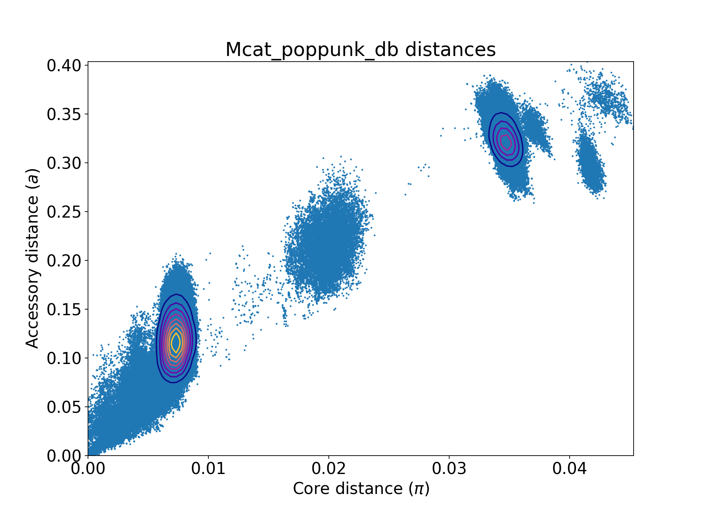
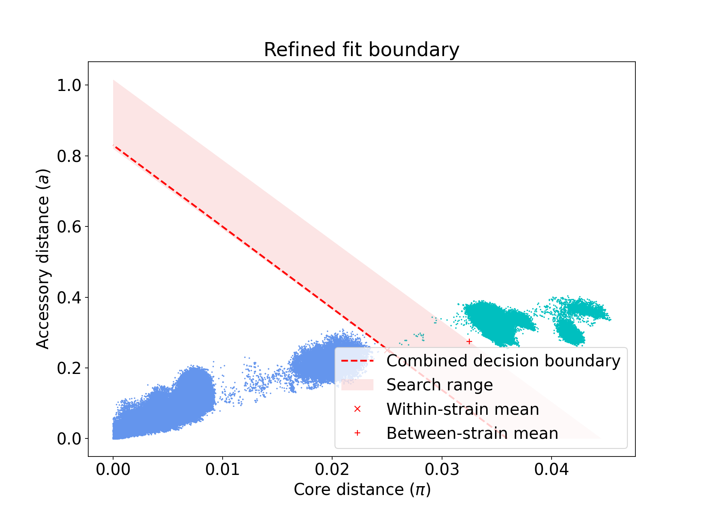
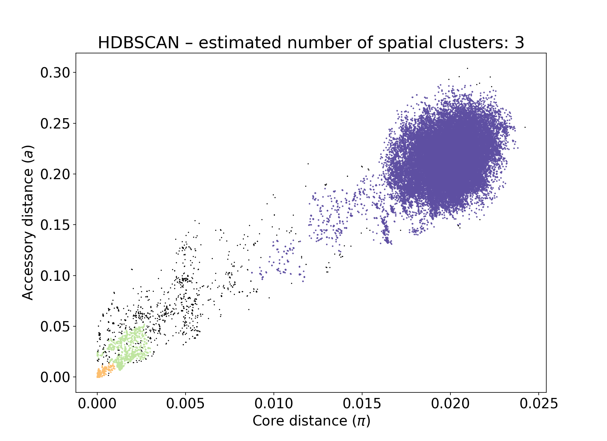
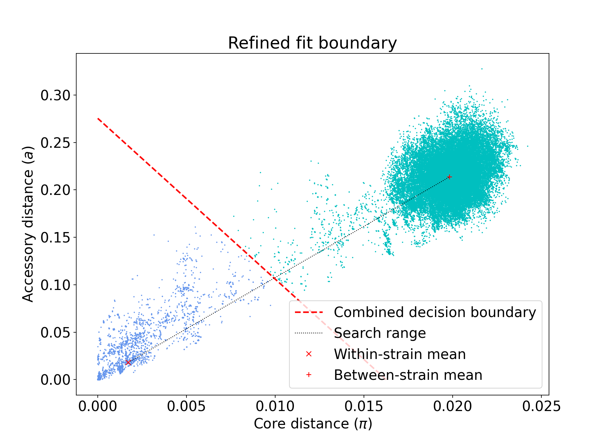
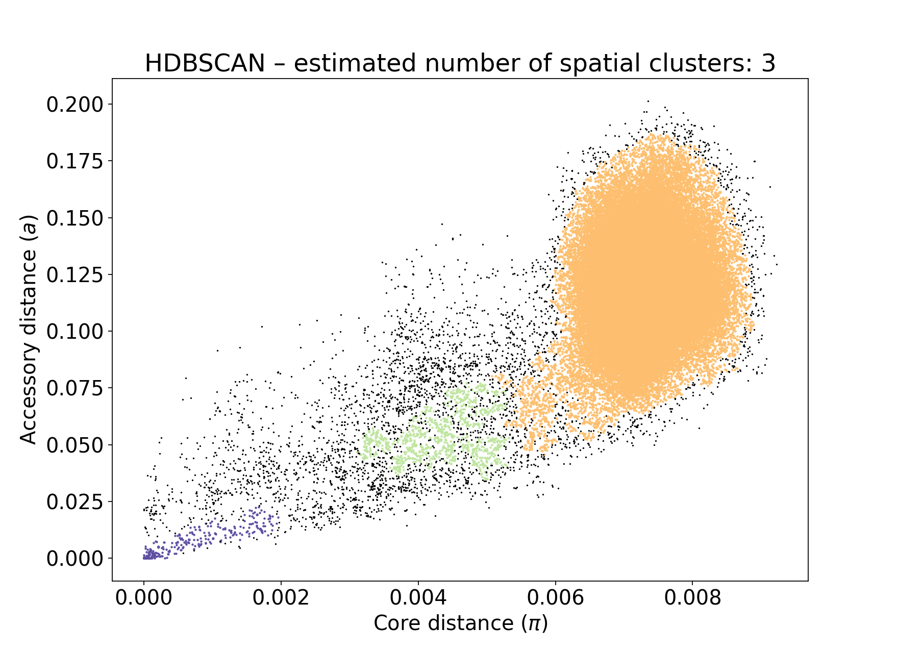
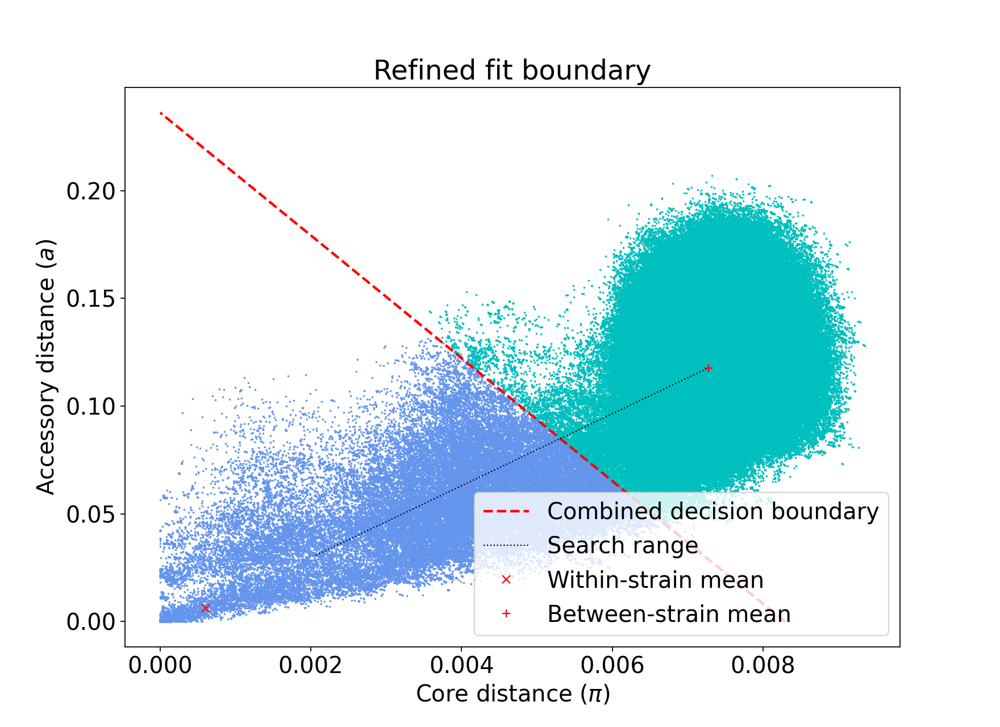
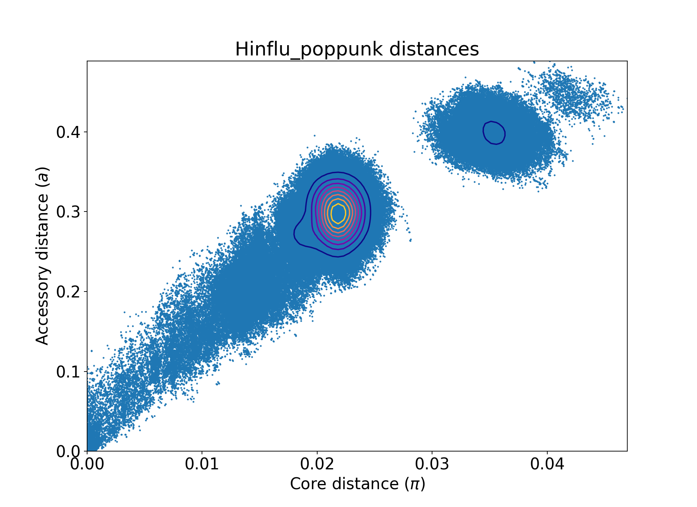

```{r setup, include=FALSE}

knitr::opts_chunk$set(echo = TRUE)
require(magrittr)
require(tidyverse)
require(stringr)
require(GGally)
require(archive)
require(kableExtra)
require(ggforce)
require(ggrepel)
require(patchwork)
require(igraph)
require(gggenes)
require(readr)

theme_set(theme_bw() + theme(strip.background = element_blank()))

```

# Functions

``` {r Functions}

compute_pairwise_distances <- function(df) {
  
  # Create all pairwise combinations of rows (upper triangle, no self-pairs)
  tidyr::expand_grid(
    i = seq_len(nrow(df)),
    j = seq_len(nrow(df))
  ) |>
    filter(i < j) |>
    mutate(
      # Sample identifiers for each pair
      sample_i = df$Sample_Name[i],
      sample_j = df$Sample_Name[j],
      
      # Cluster assignments for each pair
      cluster_i = df$Standard_Cluster[i],
      cluster_j = df$Standard_Cluster[j],
      
      # Euclidean distance: sqrt((x2 - x1)^2 + (y2 - y1)^2)
      euclidean_dist = sqrt(
        (df$tsne1D[j] - df$tsne1D[i])^2 +
        (df$tsne2D[j] - df$tsne2D[i])^2
      ),
      
      # Absolute size difference
      size_diff = abs(df$size[j] - df$size[i]),
      
      # Classify whether the pair shares a cluster
      same_cluster = case_when(
        cluster_i == "-1" | cluster_j == "-1" ~ "Unassigned",
        cluster_i == cluster_j               ~ "Same cluster",
        TRUE                                 ~ "Different cluster"
      )
    ) |>
    select(
      sample_i, sample_j,
      cluster_i, cluster_j,
      euclidean_dist,
      size_diff,
      same_cluster
    )
}

merge_clusters_by_distance <- function(df, dist_df, plasmid_dist_threshold, size_diff_threshold) {
  
  # --- Build edges from all pairs below both thresholds ---
  edges <- dist_df |>
    filter(
      euclidean_dist <= plasmid_dist_threshold & size_diff <= size_diff_threshold
    ) |>
    select(sample_i, sample_j)
  
  # --- Build graph from all samples as vertices ---
  # Isolated points (no edges) are preserved as their own single-node component
  g <- graph_from_data_frame(
    d        = edges,
    vertices = df$Sample_Name,
    directed = FALSE
  )
  
  # --- Extract connected components ---
  components_df <- tibble(
    Sample_Name    = V(g)$name,
    merged_cluster = components(g)$membership
  )
  
  # --- Join back to original df ---
  df |>
    left_join(components_df, by = "Sample_Name")
}

associate_resistance_plasmids <- function(m_df, amr_cols = NULL, plasmid_cols = NULL) {
  
  plasmid_res_df <-
    m_df %>% 
      pivot_longer(cols = dplyr::any_of(amr_cols), 
                   names_to = "Resistance gene", 
                   values_to = "Resistance gene presence") %>% 
      pivot_longer(
        cols = dplyr::any_of(plasmid_cols), 
        names_to = "Plasmid", 
        values_to = "Plasmid presence") %>% 
      dplyr::select(id,
                    `Resistance gene`,
                    `Resistance gene presence`,
                    Plasmid,
                    `Plasmid presence`)
      
  
  # Step 2: Count bacteria with each plasmid (denominator)
  total_plasmid <-
    plasmid_res_df  %>%
      dplyr::filter(`Plasmid presence` != "Absent") %>%
      dplyr::distinct(id, Plasmid) %>%
      dplyr::count(Plasmid, name = "total_bacteria_and_plasmid")
  
  # Step 3: Count bacteria with gene and plasmid (numerator)
  plasmid_gene_counts <-
    plasmid_res_df  %>%
      dplyr::filter(`Resistance gene presence` != "Absent" &
                    `Plasmid presence` != "Absent") %>%
      dplyr::distinct(id, `Resistance gene`, Plasmid) %>% 
      dplyr::count(`Resistance gene`, Plasmid, name = "count_gene_plasmid")
  
  # Step 4: Join and compute proportion
  plasmid_resistance_prop_df <-
    plasmid_gene_counts %>%
      dplyr::left_join(total_plasmid, by = "Plasmid") %>%
      dplyr::mutate(total_bacteria_and_plasmid =
                      dplyr::if_else(is.na(total_bacteria_and_plasmid),
                                     0,
                                     total_bacteria_and_plasmid)
                    ) %>% 
      dplyr::mutate(proportion = count_gene_plasmid / total_bacteria_and_plasmid) %>% 
      tidyr::complete(`Resistance gene`,
                      Plasmid,
                      fill = list(total_bacteria_and_plasmid = 0,
                                  proportion = 0))
  
  return(plasmid_resistance_prop_df)
}

widen_amr_data <- function(amr_df) {
  
  amr_df %>%
    # Split into list column
    mutate(gene_list = str_split(AB_resistance, ",")) %>%
    # Clean whitespace
    mutate(gene_list = map(gene_list, str_trim)) %>%
    # Unnest to long format
    unnest(gene_list) %>%
    # Remove original column
    select(-AB_resistance) %>%
    # Add presence indicator
    mutate(present = "Present") %>%
    distinct() %>% 
    # Pivot to wide format
    pivot_wider(
      names_from = gene_list,
      values_from = present,
      values_fill = "Absent"
    )
  
}

add_to_microreact <- function(df1,df2,absent_value = "") {
  
  df1 %>%
    dplyr::left_join(df2,
                     by = c("id"="npg_run_id")) %>% 
    dplyr::mutate(across(everything(), ~ ifelse(is.na(.x), absent_value, .x))) %>% 
    dplyr::select(where(~!all(.x==absent_value)))
  
}

make_cluster_freq_wide_species <- function(mcat_cluster_freq,
                                           species_col  = "Species",
                                           clusters_col = "Cluster",
                                           cohort_col   = "Cohort") {

  # Wide: rows = Cluster, columns = Cohort; one table per Species
  # We'll keep long by species + cluster, wide by cohort.
  mcat_cluster_freq_wide <- mcat_cluster_freq %>%
    dplyr::mutate(Cohort =
                    factor(Cohort,
                           levels = c(
                             "Drakenstein",
                             "Hampshire (early)",
                             "Hampshire (late)",
                             "Maela",
                             "Siem Reap"
                           )
                    )
                  ) %>% 
    dplyr::arrange(rev(Cohort)) %>% 
    select(
      !!sym(species_col),
      !!sym(clusters_col),
      !!sym(cohort_col),
      Frequency
    ) %>%
    pivot_wider(
      id_cols    = c(!!sym(species_col), !!sym(clusters_col)),
      names_from = !!sym(cohort_col),
      values_from = Frequency
    )

  mcat_cluster_freq_wide
}

make_pair_panel_species <- function(wide_df,
                                    species_name,
                                    cohort_x,   # x-axis cohort
                                    cohort_y,   # y-axis cohort
                                    point_colour) {
  df_pair <- wide_df %>%
    dplyr::filter(Species == species_name) %>%
    dplyr::select(Species, Cluster, dplyr::all_of(c(cohort_x, cohort_y))) %>%
    # keep clusters present in at least one of the two cohorts
    dplyr::filter(
      !(is.na(.data[[cohort_x]]) & is.na(.data[[cohort_y]]))
    ) %>%
    dplyr::mutate(
      !!cohort_x := tidyr::replace_na(.data[[cohort_x]], 0),
      !!cohort_y := tidyr::replace_na(.data[[cohort_y]], 0)
    )

  n_pts <- nrow(df_pair)

  if (n_pts >= 2) {
    ct <- suppressWarnings(
      cor.test(df_pair[[cohort_x]],
               df_pair[[cohort_y]],
               method = "spearman",
               exact  = FALSE)
    )
    p_val <- ct$p.value
    p_lab <- paste0("p = ", formatC(p_val, format = "e", digits = 2))
  } else {
    p_lab <- "p = NA"
  }

  ggplot(df_pair, aes(x =.data[[cohort_x]], y =.data[[cohort_y]])) +
    geom_point(alpha = 0.6, size = 0.7, colour = point_colour) +
    geom_smooth(formula = y ~ x,
                method = "lm",
                se = FALSE,
                colour = "#FD6467",
                linewidth = 0.5) +
    # numeric labels: N and p
    annotate("text",
             x = -Inf, y = Inf,
             label = paste0("N = ", n_pts),
             hjust = -0.1, vjust = 1.5,
             size = 3) +
    annotate("text",
             x = Inf, y = Inf,
             label = p_lab,
             hjust = 1.1, vjust = 1.5,
             size = 3) +
    labs(x = NULL, y = NULL) +
    theme_minimal(base_size = 9) +
    theme(
      #axis.text.x  = element_blank(),
      #axis.text.y  = element_blank(),
      axis.ticks.x = element_blank(),
      axis.ticks.y = element_blank(),
      panel.grid   = element_line(colour = "grey90", linewidth = 0.2)
    )
}

make_diag_hist_panel <- function(wide_df,
                                 cohort,
                                 species1,
                                 species2,
                                 species_palette) {
  df_long <- wide_df %>%
    dplyr::filter(Species %in% c(species1, species2)) %>%
    dplyr::select(Species, Cluster, dplyr::all_of(cohort)) %>%
    dplyr::rename(Frequency = dplyr::all_of(cohort)) %>%
    dplyr::mutate(Frequency = tidyr::replace_na(Frequency, 0)) %>%
    dplyr::filter(Frequency > 0)   # remove 0-frequency strains

  ggplot(df_long, aes(x = Frequency, fill = Species)) +
    geom_histogram(position = "identity",
                   alpha    = 0.5,
                   bins     = 30,  # adjust as you like
                   colour   = NA) +
    scale_fill_manual(values = species_palette) +
    labs(x = NULL, y = NULL) +
    ylim(c(0,2000)) +
    theme_minimal(base_size = 9) +
    theme(
      legend.position = "none",
      #axis.text.x  = element_blank(),
      #axis.text.y  = element_blank(),
      axis.ticks.x = element_blank(),
      axis.ticks.y = element_blank(),
      panel.grid   = element_line(colour = "grey90", linewidth = 0.2)
    )
}

make_diag_rank_panel <- function(wide_df,
                                 cohort,
                                 species1,
                                 species2,
                                 species_palette) {
  df_long <- wide_df %>%
    dplyr::filter(Species %in% c(species1, species2)) %>%
    dplyr::select(Species, Cluster, dplyr::all_of(cohort)) %>%
    dplyr::rename(Frequency = dplyr::all_of(cohort)) %>%
    dplyr::mutate(Frequency = tidyr::replace_na(Frequency, 0)) %>%
    dplyr::filter(Frequency > 0)  # remove 0-frequency strains

  df_ranked <- df_long %>%
    dplyr::group_by(Species) %>%
    dplyr::arrange(dplyr::desc(Frequency),.by_group = TRUE) %>%
    dplyr::mutate(Rank = dplyr::row_number()) %>%
    dplyr::ungroup()

  ggplot(df_ranked, aes(x = Rank, y = Frequency, colour = Species)) +
    geom_point(alpha = 0.7, size = 0.7) +
    geom_line(alpha = 0.6, linewidth = 0.4) +
    scale_colour_manual(values = species_palette) +
    labs(x = NULL, y = NULL) +
    theme_minimal(base_size = 9) +
    theme(
      legend.position = "none",
      #axis.text.x  = element_blank(),
      #axis.text.y  = element_blank(),
      axis.ticks.x = element_blank(),
      axis.ticks.y = element_blank(),
      panel.grid   = element_line(colour = "grey90", linewidth = 0.2)
    )
}

plot_mcat_cluster_pairs_two_species <- function(mcat_strains_freq,
                                                species1,
                                                species2,
                                                species_palette = c(species1 = "steelblue",
                                                                    species2 = "darkorange"),
                                                drakenstein_name = "Drakenstein",
                                                hist_on_diagonal = FALSE) {

  wide_df <- make_cluster_freq_wide_species(mcat_strains_freq)

  all_cohorts <- setdiff(names(wide_df), c("Species", "Cluster"))

  # Columns: all cohorts (including Drakenstein)
  col_cohorts <- all_cohorts

  # Rows for main grid: all except Drakenstein
  row_cohorts <- setdiff(all_cohorts, drakenstein_name)

  n_rows_main <- length(row_cohorts)
  n_cols      <- length(col_cohorts)

  panels <- list()

  blank_panel <- ggplot() + theme_void()

  # Set diagonal plot function
  diag_plot <- make_diag_rank_panel
  if (hist_on_diagonal) {
    diag_plot <- make_diag_hist_panel
  }
  
  ## Main grid (rows = row_cohorts; cols = col_cohorts)
  for (row_idx in seq_len(n_rows_main)) {
    for (col_idx in seq_len(n_cols)) {
      cx <- col_cohorts[col_idx]
      cy <- row_cohorts[row_idx]

      if (cx == cy) {
        # Diagonal for non-Drakenstein cohorts
        p <- diag_plot(
          wide_df,
          cohort          = cx,
          species1        = species1,
          species2        = species2,
          species_palette = species_palette
        )
      } else if (match(cx, all_cohorts) > match(cy, all_cohorts)) {
        # Upper-right: species1
        p <- make_pair_panel_species(
          wide_df      = wide_df,
          species_name = species1,
          cohort_x     = cx,
          cohort_y     = cy,
          point_colour = species_palette[species1]
        )
      } else {
        # Lower-left: species2
        p <- make_pair_panel_species(
          wide_df      = wide_df,
          species_name = species2,
          cohort_x     = cx,
          cohort_y     = cy,
          point_colour = species_palette[species2]
        )
      }

      # Column labels on top row only
      if (row_idx == 1) {
        p <- p + ggtitle(cx) +
          theme(
            plot.title = element_text(hjust = 0.5, size = 10)
          )
      } else {
        p <- p + ggtitle(NULL)
      }

      # Y-axis cohort labels on first column only
      if (col_idx == 1) {
        p <- p +
          labs(y = cy) +
          theme(
            axis.title.y = element_text(angle = 90, size = 9, vjust = 0.5)
          )
      } else {
        p <- p + labs(y = NULL)
      }

      # No x-axis labels anywhere
      p <- p + labs(x = NULL)

      panels[[length(panels) + 1]] <- p
    }
  }

  ## Extra bottom row: Drakenstein self-self at its column
  drak_col_idx <- match(drakenstein_name, col_cohorts)

  for (col_idx in seq_len(n_cols)) {
    cx <- col_cohorts[col_idx]

    if (!is.na(drak_col_idx) && col_idx == drak_col_idx) {
      # Drakenstein diagonal panel
      p <- diag_plot(
        wide_df,
        cohort          = drakenstein_name,
        species1        = species1,
        species2        = species2,
        species_palette = species_palette
      )
    } else {
      p <- blank_panel
    }

    # Bottom row: no x or y labels
    p <- p + ggtitle(NULL) + labs(x = NULL, y = NULL)

    panels[[length(panels) + 1]] <- p
  }

  patchwork::wrap_plots(panels, nrow = n_rows_main + 1, ncol = n_cols)
}

process_gene_frequencies <- function(df,m_df) {
  
   df %>% 
      dplyr::filter(CDS != "" & !is.na(CDS)) %>% 
      dplyr::select(Gene,npg_run_id) %>% 
      dplyr::rename(id = npg_run_id) %>% 
      dplyr::left_join(m_df %>% 
                         dplyr::select(id,Cohort),
                       by = "id") %>% 
    group_by(Cohort, 
             Gene) %>%
    mutate(Strains_count = n_distinct(id)) %>%
    dplyr::ungroup() %>%
    group_by(Cohort) %>%
    mutate(Frequency = Strains_count / n_distinct(id)) %>% 
    dplyr::ungroup() %>% 
    dplyr::select(-id) %>% 
    dplyr::distinct() %>% 
    dplyr::filter(!is.na(Cohort)) %>% 
    dplyr::rename(Cluster = Gene)
  
}

process_strain_frequencies <- function(df) {
  
   df %>%
    dplyr::mutate(Cluster = as.character(Cluster)) %>% 
    group_by(Cohort, 
             Cluster) %>%
    summarise(Strains_count = n_distinct(id), 
              .groups = "drop") %>%
    dplyr::ungroup() %>%
    group_by(Cohort) %>%
    mutate(Frequency = Strains_count / sum(Strains_count)) %>% 
    dplyr::ungroup()
  
}

```

# Load data from project

Import sample data from project

```{r Process sample data}

parse_sample_file <- function(fn) {
  
  read.table(file = fn,
             sep = "\t",
             comment.char = "",
             header = TRUE)
  
}

process_annotation_file_names <- function(df) {
  
   df %>%
    dplyr::filter(file_type == "annotation") %>%
    dplyr::mutate(npg_run_id = gsub("(.)+/","",path)) %>% 
    dplyr::mutate(annotation_file = paste0(stringr::str_sub(file_uuid, start = 1L, end = 6L),'_',npg_run_id)) %>% 
    dplyr::mutate(npg_run_id = gsub(".gff","",npg_run_id)) %>% 
    dplyr::select(-path)
  
}

process_assembly_file_names <- function(df) {
  
   df %>%
    dplyr::filter(file_type == "assembly") %>%
    dplyr::mutate(npg_run_id = gsub("(.)+/","",gsub("/velvet_assembly/contigs.fa","",gsub("/spades_assembly/contigs.fa","",path)))) %>% 
    dplyr::mutate(assembly_file = paste0(stringr::str_sub(file_uuid, start = 1L, end = 6L),'_contigs.fa')) %>% 
    dplyr::select(npg_run_id,assembly_file)
  
}

process_qc_file_names <- function(df) {
  
   df %>%
    dplyr::filter(file_type == "qc") %>%
    dplyr::mutate(npg_run_id = gsub("(.)+/","",gsub("/kraken.report","",path))) %>% 
    dplyr::mutate(qc_file = paste0(stringr::str_sub(file_uuid, start = 1L, end = 6L),'_kraken.report')) %>% 
    dplyr::select(npg_run_id,qc_file)
  
}

# Parse sample files
drak_info_df <-
  read.csv("./sample_data/Drakenstein_epi.csv") %>% 
      dplyr::mutate(Year = as.numeric(Year)) %>% 
      dplyr::left_join(
        read_csv("./sample_data/Drakenstein_accessions.csv"),
        by = c("Isolate"="run_accession")
        )

info_df <-
  dplyr::bind_rows(
    parse_sample_file("./sample_data/6588_info.tsv") %>% 
      dplyr::filter(!grepl("HiC_RMV",sample_supplier_name)) %>%
      dplyr::mutate(project = "6588"),
    parse_sample_file("./sample_data/6310_info.tsv") %>%
      dplyr::mutate(project = "6310"),
    drak_info_df %>% 
      dplyr::mutate(name = Isolate,
                    sample_accession_number = sample_accession,
                    sample_common_name = "Moraxella catarrhalis",
                    project = "Drakenstein",
                    sample_supplier_name = Isolate
                    ) %>% 
      dplyr::select(name,sample_accession_number,sample_common_name,project,sample_supplier_name)
    )

run_df <-
  dplyr::bind_rows(
    parse_sample_file("./sample_data/6588_runs.tsv") %>% 
      dplyr::select(-name),
    parse_sample_file("./sample_data/6310_runs.tsv") %>% 
      dplyr::select(-name)
    )

fn_6588 <- "./sample_data/6588_files.tsv"
fn_6310 <- "./sample_data/6310_files.tsv"
files_df <-
  dplyr::bind_rows(
    parse_sample_file(fn_6588) %>% process_annotation_file_names(),
    parse_sample_file(fn_6310) %>% process_annotation_file_names()
    ) %>% dplyr::left_join(
    dplyr::bind_rows(
      parse_sample_file(fn_6588) %>% process_assembly_file_names(),
      parse_sample_file(fn_6310) %>% process_assembly_file_names()
      ),
    by = c("npg_run_id")
    ) %>% dplyr::left_join(
    dplyr::bind_rows(
      parse_sample_file(fn_6588) %>% process_qc_file_names(),
      parse_sample_file(fn_6310) %>% process_qc_file_names()
      ), 
    by = c("npg_run_id")
    )

epi_df <-
  dplyr::bind_rows(
    read.csv("./sample_data/Asian_isolate_data.csv") %>% 
      dplyr::mutate(Description = gsub(" from nasopharyngeal swab","",Description)) %>%
      dplyr::mutate(project = "6588") %>% 
      dplyr::mutate(Species = Description) %>% 
      dplyr::mutate(Description = dplyr::if_else(Species == "Mixed bacteria","Mixed bacteria","Single isolate")),
    read.csv("./sample_data/Hampshire_isolate_data.csv") %>% 
      dplyr::mutate(Cohort = Country) %>%
      dplyr::mutate(project = "6588") %>% 
      dplyr::mutate(Description = "Single isolate"),
    read.csv("./sample_data/Global-Hinf-metadata-microreact.csv") %>% 
      dplyr::filter(disease == "") %>% 
      dplyr::select(id,country,Year) %>% 
      dplyr::filter(country == "Maela") %>% 
      dplyr::rename(Isolate = id,
                    Region = country) %>% 
      dplyr::mutate(Sample = Isolate,
                    Region = "Maela",
                    Cohort = "Maela",
                    Country = "Thailand",
                    Species = "Haemophilus influenzae",
                    project = "6310",
                    Year = as.numeric(Year)) %>% 
      dplyr::mutate(npg_run_id = gsub("(_.*?)_", "\\1#", Sample)) %>% 
      dplyr::mutate(Description = "Single isolate"),
    drak_info_df %>% 
      dplyr::mutate(Isolate = sample_accession) %>% 
      dplyr::select(-sample_accession) %>% 
      dplyr::mutate(Description = "Single isolate")
    ) %>% 
  dplyr::mutate(join_col = dplyr::case_when(
    project == "6588" ~ Sample,
    Country == "South Africa" ~ Isolate,
    TRUE ~ npg_run_id)) %>% 
  dplyr::select(-c(project,npg_run_id,Sample))

# Merge data
sample_df <-
  info_df %>% 
    dplyr::left_join(run_df, by = c("sample_uuid")) %>% 
    dplyr::left_join(files_df, by = c("npg_run_id")) %>% 
    dplyr::mutate(npg_run_id = dplyr::if_else(project == "Drakenstein",
                                              sample_accession_number,
                                              npg_run_id)) %>%
    dplyr::mutate(join_col = dplyr::if_else(project == "6588",sample_donor_id,npg_run_id)) %>% 
    dplyr::left_join(epi_df, by = c("join_col")) %>% 
    dplyr::mutate(Isolate = dplyr::if_else(project == "6310",name,Isolate)
                  ) %>% 
    dplyr::select(-join_col) %>% 
    dplyr::filter(!is.na(Country)) %>% 
    dplyr::mutate(Cohort = dplyr::if_else(Cohort == "Thailand","Maela",Cohort)) %>% 
    dplyr::mutate(Cohort =
                    dplyr::case_when(
                      Cohort == "Maela" ~ "Maela",
                      Cohort == "Cambodia" ~ "Siem Reap",
                      Cohort == "Drakenstein" ~ "Drakenstein",
                      Cohort == "United Kingdom" & Year < 2014 ~ "Hampshire (early)",
                      Cohort == "United Kingdom" & Year > 2014 ~ "Hampshire (late)"
                      )
                  ) %>% 
  dplyr::mutate(Year =
                  dplyr::case_when(
                    !is.na(Year) ~ as.numeric(as.character(Year)),
                    grepl("_08B",sample_supplier_name) ~ 2008,
                    grepl("_09B",sample_supplier_name) ~ 2009,
                    grepl("_10B",sample_supplier_name) ~ 2010,
                    grepl("STGG",sample_supplier_name) ~ 2009, # Unclear use mid-range
                    grepl("MISSING",sample_supplier_name) ~ 2009, # Unclear use mid-range
                    TRUE ~ NA_real_
                  )
                )

plot_plasmid_function <- function(fn, title_str = NULL) {
  
  if (is.null(title_str)) {
    title_str = fn
  }
  
  plasmid_tsv <-
    readr::read_tsv(paste0('./plasmid_annotations/',fn),
                    col_names = TRUE,skip = 5)
  
  ggplot(plasmid_tsv, aes(xmin = Start, xmax = Stop, y = `#Sequence Id`, fill = Gene)) +
  geom_gene_arrow() +
  facet_wrap(~ `#Sequence Id`, scales = "free", ncol = 1) +
  scale_fill_brewer(palette = "Set3") +
  ggtitle(title_str) +
  theme_genes()
  
}

species_palette <- c(
  "Haemophilus influenzae" = "#E6A0C4FF",
  "Moraxella catarrhalis" = "#C6CDF7FF",
  "Plate sweep" = "#7294D4FF",
  "Mixed bacteria" = "#7294D4FF",
  "Other" = "#D8A499FF",
  "Unknown" = "#D8A499FF"
)

```

# Analysis of short-read data

## Quality control of data and association with sample information

### Identify species with Kraken and Bracken

Analysis of the short reads used the `qc-short-read` pipeline (revision 103cba2a10; v1.0.2), which depends upon:

-   fastqc (v0.12.1)

-   multiqc (v1.19)

-   kraken2 (v2.1.3)

-   bracken (v2.8)

The results are stored for projects [6310](./pipeline_info/execution_report_2025-09-14_08-15-34.html) and [6588](./pipeline_info/execution_report_2025-09-14_08-18-09.html).

```{bash, eval = FALSE}

module load bsub.py
module load qc-short-read
cd 6310_qc
echo -en "ID\tR1\tR2\n" > 6310.manifest; for f in ./results/fastqs/*_1.fastq.gz; do BASENAME=`basename ${f}`; echo -en "${BASENAME%_1.fastq.gz}\t${f}\t${f%_1.fastq.gz}_2.fastq.gz\n"; done >> 6310.manifest
bsub.py -q oversubscribed 4 6310_qc_rerun qc-short-read --manifest_of_reads 6310.manifest --kraken2_db /data/pam/software/kraken2/standard/k2_standard_20250402 --read_len 150 --classification_level S --enable_building -ansi-log false
cd ../6588_qc
echo -en "ID\tR1\tR2\n" > 6588.manifest; for f in ./results/fastqs/*_1.fastq.gz; do BASENAME=`basename ${f}`; echo -en "${BASENAME%_1.fastq.gz}\t${f}\t${f%_1.fastq.gz}_2.fastq.gz\n"; done >> 6588.manifest
bsub.py -q oversubscribed 4 6588_qc_rerun qc-short-read --manifest_of_reads 6588.manifest --kraken2_db /data/pam/software/kraken2/standard/k2_standard_20250402 --read_len 150 --classification_level S --enable_building -ansi-log false

```

Download data from the Drachenstein study; results are available [here](./pipeline_info/execution_report_2025-10-22_06-07-18.html):

``` {bash, eval = FALSE}

cd DRAK_study
module load PaM/environment
module load qc-short-read
module load bsub.py

bsub.py -q oversubscribed 4 DRAK_qc qc-short-read --manifest_ena DRAK.manifest --accession_type run --kraken2_db /data/pam/software/kraken2/standard/k2_standard_20250402 --read_len 150 --classification_level S --enable_building -ansi-log false
# Re-run for 7 failed samples
bsub.py -q oversubscribed 4 DRAK_qc_rerun qc-short-read -r 1.0.2 --manifest_ena DRAK_rerun.manifest --accession_type run --kraken2_db /data/pam/software/kraken2/standard/k2_standard_20250402 --read_len 150 --classification_level S --enable_building -ansi-log false

```

This run failed for seven isolates, which were subsequently re-run.

### Assemble reads with SPAdes and unicycler

Analysis of the short reads used the `assembly-unicycler-short-read` pipeline (v1.2.5; commit 92464961e453d624e88e69da06670638fb90ede0), developed from the bacass pipeline (v2.5.0; <https://zenodo.org/records/17378847>), which depends upon:

-   QUAST (v5.0.2)

-   Unicycler (v0.5.1)

-   SPAdes (v4.0.0)

The results are stored for projects [6310](./pipeline_info/execution_report_2025-09-11_17-26-05.html) and [6588](./pipeline_info/execution_report_2025-09-11_20-15-21.html).

```{bash, eval = FALSE}

git clone --recurse-submodules git@gitlab.internal.sanger.ac.uk:sanger-pathogens/pipelines/assembly_unicycler_short_read.git
cd assembly_unicycler_short_read
echo -en "ID,R1,R2\n" > 6310.manifest; for f in ../6310_qc/results/fastqs/*_1.fastq.gz; do BASENAME=`basename ${f}`; echo -en "${BASENAME},/data/pam/team284/nc3/scratch/NP_AMR/data/6310_qc/results/fastqs/${BASENAME},/data/pam/team284/nc3/scratch/NP_AMR/data/6310_qc/results/fastqs/${BASENAME%_1.fastq.gz}_2.fastq.gz\n"; done >> 6310.manifest
echo -en "ID,R1,R2\n" > 6588.manifest; for f in ../6588_qc/results/fastqs/*_1.fastq.gz; do BASENAME=`basename ${f}`; echo -en "${BASENAME},/data/pam/team284/nc3/scratch/NP_AMR/data/6588_qc/results/fastqs/${BASENAME},/data/pam/team284/nc3/scratch/NP_AMR/data/6588_qc/results/fastqs/${BASENAME%_1.fastq.gz}_2.fastq.gz\n"; done >> 6588.manifest
bsub -o 6310_output.o -e 6310_error.e -q oversubscribed -R "select[mem>4000] rusage[mem=4000]" -M4000 nextflow run . --manifest ./6310.manifest --outdir 6310_assemblies
bsub -o 6588_output.o -e 6588_error.e -q oversubscribed -R "select[mem>4000] rusage[mem=4000]" -M4000 nextflow run . --manifest ./6588.manifest --outdir 6588_assemblies

```

Assemble data from the Drachenstein study; results are available [here](./pipeline_info/execution_report_2025-10-22_12-50-46.html):

``` {bash, eval = FALSE}

cd DRAK_study
module load PaM/environment
module load qc-short-read
module load bsub.py

bsub -o drak_output.o -e drak_error.e -q oversubscribed -R "select[mem>4000] rusage[mem=4000]" -M4000 nextflow run . --manifest_ena /data/pam/team284/nc3/scratch/NP_AMR/data/DRAK_study/DRAK.manifest --accession_type run --outdir /data/pam/team284/nc3/scratch/NP_AMR/data/DRAK_study/assemblies

```

### Annotate assemblies with Bakta

The assemblies were annotated using Bakta (version 1.11.0).

```{bash, eval = FALSE}

module load bakta/1.11.0
declare -i N; N=1; for f in *.fa; do echo "bakta --db /data/pam/software/bakta/v6.0 --prefix ${f%.fa} --output ${f%.fa}_annotation --gram - --threads 4 ${f}" > bacta_job.${N}; chmod +x ./bacta_job.${N}; N=($N+1); done
bsub -n 4 -M 4000 -R 'select[mem>4000] rusage[mem=4000] span[hosts=1]' -o bakta.%I.o -e bakta.%I.e -J bakta_run[1-4473] ./bacta_job.\${LSB_JOBINDEX}

```

This was also run on the Drachenstein isolates, after 1427/1429 isolates were successfully downloaded and assembled:

```{bash, eval = FALSE}

module load bakta/1.11
declare -i N; N=1; for f in *.fa; do echo "bakta --db /data/pam/software/bakta/v6.0 --prefix ${f%.fa} --output ${f%.fa}_annotation --gram - --threads 4 ${f}" > bacta_job.${N}; chmod +x ./bacta_job.${N}; N=($N+1); done
bsub -n 4 -M 12000 -R 'select[mem>12000] rusage[mem=12000] span[hosts=1]' -o bakta.%I.o -e bakta.%I.e -J bakta_run[1-1427] ./bacta_job.\${LSB_JOBINDEX}

```

### Evaluate assemblies with Quast

Assembly statistics were calculated with Quast (version 5.0.2).

```{r Parse assembly statistics data}

# Parse assembly statistics
assembly_stats_df <-
  dplyr::bind_rows(
    read.table(file = "./sample_data/NP_quast_report.tsv",
             check.names = FALSE,
             comment.char = "",
             sep ="\t",
             header = TRUE),
    read.table(file = "./sample_data/Drakenstein_summary_quast_report.tsv",
             check.names = FALSE,
             comment.char = "",
             sep ="\t",
             header = TRUE) %>% 
      dplyr::mutate(Assembly = gsub(".assembly","",Assembly))
  ) %>% 
    dplyr::rename(npg_run_id = Assembly)

```

### Quality control parameters for genomic assemblies

We will use these two files to merge getting chronological data set.

```{r, merge data, echo=TRUE}

sample_assemblies_df <- 
  right_join(as_tibble(assembly_stats_df),
             as_tibble(sample_df),
             by = "npg_run_id")

minimum_length <- 1725000
maximum_length <- 2250000
n50_threshold <- 80000

```

We used total length and N50 of each genomes to find quality of genomes with baseline threshold of $N_{50}$ (y-axis) is `r n50_threshold` bp and total length (x-axis) which is from `r minimum_length` Mbp to `r maximum_length` Mbp.

```{r, plot-genome assembly, include=TRUE}

ggplot(data = sample_assemblies_df) + 
  geom_point(aes
             (x = `Total length`, 
               y = N50, 
               colour = Species)) +
  geom_hline(yintercept = n50_threshold, linetype = 2) + 
  geom_vline(xintercept = c(minimum_length, 
                            maximum_length), linetype = 2) +
  scale_colour_manual(values = species_palette) +
  scale_x_log10() + 
  ylab(expression(N[50]~"(bp)")) +
  xlab("Total length (bp)") +
  theme(legend.position = "bottom")
                                            
```

These thresholds were used to remove low-quality assemblies:

```{r, filter-data, include=TRUE}

high_quality_assemblies_df <- 
  sample_assemblies_df %>%
  filter(N50 > n50_threshold & 
           (`Total length` > minimum_length & 
              `Total length` < maximum_length))

ggplot(data = sample_assemblies_df) + 
  geom_point(aes
             (x = `Total length`, 
               y = N50, colour = Species)) + 
  geom_vline(xintercept = c(minimum_length, 
                            maximum_length), linetype = 2) +
  geom_hline(yintercept = n50_threshold, linetype = 2) + 
  scale_colour_manual(values = species_palette) +
  xlim(0.9*minimum_length,1.1*maximum_length)

```

### Identification of the species present in each sequence dataset

Braken was used to identify the species present in each sample using the qc-short-read pipeline (v2.0.2), as part of the analysis described above. To check for contamination, we identify the species present in each dataset, and compare these outputs with the expected composition of the samples.

```{r Parse bracken outputs}

parse_bracken <- function(fn) {
  
  read.table(file = gzfile(fn),
             check.names = FALSE,
             comment.char = "",
             sep ="\t",
             header = TRUE) %>% 
    dplyr::filter(grepl("s__",Classification))
}

species_match_threshold = 10000000

species_abundance_df <-
  parse_bracken("./sample_data/6310_bracken_summary_report.tsv.gz") %>%  
  dplyr::full_join(
    parse_bracken("./sample_data/6588_bracken_summary_report.tsv.gz"),
    by = "Classification"
  ) %>%
  dplyr::full_join(parse_bracken("./sample_data/Drakenstein_bracken_summary_report.tsv.gz"),
    by = "Classification"
  ) %>%
  dplyr::full_join(parse_bracken("./sample_data/Drakenstein_rerun_bracken_summary_report.tsv.gz"),
    by = "Classification"
  ) %>%
  dplyr::mutate(Classification = gsub("(.)*\\|s__","",Classification)) %>%
  tidyr::pivot_longer(cols = -Classification, names_to = "npg_run_id", values_to = "matches") %>% 
  dplyr::rename(Species = Classification) %>% 
  dplyr::mutate(matches = dplyr::if_else(is.na(matches),0,matches)) %>% 
  dplyr::group_by(Species) %>% 
  dplyr::mutate(Total = sum(matches)) %>% 
  dplyr::ungroup() %>% 
  dplyr::filter(Total > species_match_threshold)

# Join with sample information
species_sample_df <-
  species_abundance_df %>% 
    dplyr::rename(Detected_species = Species) %>% 
    dplyr::full_join(
      sample_df %>% 
        dplyr::rename(Expected_species = Species),
      by = "npg_run_id"
    ) %>% 
    dplyr::filter(!is.na(Country)) %>%  # Removing pre-filtered datasets, e.g. those dropped from HINTVAC
    # Reformat taxonomic labels
    dplyr::filter(!is.na(Detected_species)) %>% 
    dplyr::mutate(Detected_species = gsub("_"," ",Detected_species)) %>% 
    dplyr::mutate(Detected_genus = stringr::str_extract(Detected_species, '[A-Za-z]+'),
                  Expected_genus = stringr::str_extract(Expected_species, '[A-Za-z]+')
                  ) %>% 
    # Calculate proportion of reads by species and genus
    dplyr::group_by(npg_run_id) %>%
    dplyr::mutate(species_read_count = matches,
                  read_count = sum(matches)
                  ) %>%
    dplyr::ungroup() %>% 
    dplyr::group_by(npg_run_id,Detected_genus) %>% 
    dplyr::mutate(genus_read_count = sum(matches)) %>% 
    dplyr::ungroup() %>% 
    dplyr::group_by(npg_run_id) %>%
    dplyr::mutate(Matching_species_proportion = dplyr::if_else(Detected_species == Expected_species,
                                                       species_read_count / read_count,
                                                       NA_real_),
                  Matching_genus_proportion = dplyr::if_else(Detected_genus == Expected_genus,
                                                       genus_read_count / read_count,
                                                       NA_real_)
                  ) %>%
    tidyr::fill(Matching_species_proportion, .direction = "updown") %>%
    tidyr::fill(Matching_genus_proportion, .direction = "updown") %>%
    dplyr::ungroup()

# Plot species matches
ggplot(species_sample_df,
       aes(x = Detected_species,
           y = npg_run_id,
           fill = matches+0.5)) +
  geom_tile() +
  facet_grid(Expected_species ~., scales = "free_y") +
  scale_fill_continuous(trans = "log10") +
  theme(axis.text.x = element_text(angle = 90, vjust = 0.5, hjust = 1))

```

### Identification of high-quality single isolate datasets

The single isolate sequences of *M. catarrhalis* and *H. influenzae* should contain relatively little sequence from other species - any such presence represents contamination.

```{r Plot matching proportions for Mcat and Hinflu}

species_proportion_threshold <- 0.66

ggplot(species_sample_df %>% 
        dplyr::select(npg_run_id,
                      Description,
                      Expected_species,
                      Matching_species_proportion) %>% 
        dplyr::distinct() %>% 
        dplyr::filter(Description == "Single isolate"),
  aes(x = Expected_species,
      y = Matching_species_proportion)
  ) +
  geom_violin()+
  geom_hline(yintercept = species_proportion_threshold, linetype = "dashed", color = "red") +
  labs(x = "Species", y = "Proportion of matches to the same species")

```

Bracken only matched 60-75% of the reads from many *M. catarrhalis* datasets to the expected species. In some cases, this was because reads were instead assigned to *Moraxella* sp. ATCC 23246. In other cases, there appeared to be a high level of contamination with *Escherichia coli* or *H. influenzae*. Therefore filtering instead used the proportion of reads assigned to the expected genus:

```{r Look at matches on a genus level}

genus_proportion_threshold <- 0.95

ggplot(species_sample_df %>% 
        dplyr::select(npg_run_id,
                      Description,
                      Expected_species,
                      Matching_genus_proportion) %>% 
        dplyr::distinct() %>% 
        dplyr::filter(Description == "Single isolate"),
  aes(x = Expected_species,
      y = Matching_genus_proportion)
  ) +
  geom_violin()+
  geom_hline(yintercept = genus_proportion_threshold, linetype = "dashed", color = "red") +
  labs(x = "Species", y = "Proportion of matches to the same genus")

```

### Final filtering on sequence characteristics

We want to keep samples meeting the criteria:

- N50 above `r n50_threshold` bp

- Total length between `r minimum_length` bp and `r maximum_length` bp

- `r genus_proportion_threshold` of reads matching the expected genus

- `r species_proportion_threshold` of reads matching the expected species

```{r filter the proportion }

filtering_criteria_df <-
  sample_assemblies_df %>% 
    dplyr::select(npg_run_id,Country,Year,`Total length`,N50) %>% 
    dplyr::distinct() %>% 
    dplyr::left_join(
      species_sample_df %>% 
        dplyr::select(npg_run_id,
                      Description,
                      Expected_species,
                      Matching_species_proportion,
                      Matching_genus_proportion) %>% 
        dplyr::distinct(),
      by = "npg_run_id"
    ) %>% 
    dplyr::mutate(
      length_ok = `Total length` >= minimum_length &
                `Total length` <= maximum_length,
      n50_ok    = N50 >= n50_threshold,
      genus_ok  = Matching_genus_proportion >= genus_proportion_threshold,
      species_ok  = Matching_species_proportion >= species_proportion_threshold,
      all_ok    = length_ok & n50_ok & genus_ok & species_ok
    ) %>%
  dplyr::filter(Expected_species %in% c("Moraxella catarrhalis","Haemophilus influenzae"))

filtering_summary_df <-
  filtering_criteria_df %>% 
    dplyr::group_by(Expected_species) %>%
    dplyr::summarise(
      `Number of genomes`    = n(),
      `Expected assembly length`   = sum(length_ok, na.rm = TRUE),
      `N50 above threshold`      = sum(n50_ok,    na.rm = TRUE),
      `Not contaminated`    = sum(genus_ok,  na.rm = TRUE),
      `Correct species`    = sum(species_ok,  na.rm = TRUE),
      `Passing all criteria`      = sum(all_ok,    na.rm = TRUE),.groups = "drop"
    )

kable(filtering_summary_df) %>% 
  kable_styling(latex_options = "striped")

```

### Output lists of high-quality single isolate sequences

Here we generate the final list of QC-passing *M. catarrhalis* isolates:

```{r Filter Moraxella cattarrhalis species by npg_run_id}

Mcat_filter <-
  filtering_criteria_df %>%
    dplyr::filter(Expected_species == "Moraxella catarrhalis") %>%
    dplyr::filter(all_ok) %>% 
    dplyr::select(npg_run_id) %>%
    dplyr::distinct()

write.table(Mcat_filter,
            file = "./sample_data/Mcat_QC_pass.csv",
            col.names = FALSE,
            row.names = FALSE,
            quote = FALSE)

```

Here we generate the final list of QC-passing *H. influenzae* isolates:

```{r filter npg_run_id of Haemophilus influenzae genomes}

Hflu_filter <-
  filtering_criteria_df %>%
    dplyr::filter(Expected_species == "Haemophilus influenzae") %>%
    dplyr::filter(all_ok) %>% 
    dplyr::select(npg_run_id) %>%
    dplyr::distinct()

write.table(Hflu_filter,
            file = "./sample_data/Hflu_QC_pass.csv",
            col.names = FALSE,
            row.names = FALSE,
            quote = FALSE)

```

### Epidemiological characteristics of filtered single-isolate dataset

```{r Moraxella in each country and each year}

ggplot(filtering_criteria_df %>% 
         dplyr::filter(all_ok) %>% 
         dplyr::group_by(Expected_species,Country) %>% 
         dplyr::summarise(n = n_distinct(npg_run_id)) %>% 
         dplyr::ungroup(),
       aes(x = Country,
           y = n)) +
  geom_bar(stat = "identity") +
  geom_text(
    aes(label = n),
    position = position_dodge(width = 0.9),
    vjust = -0.3, size = 3
    ) +
  facet_wrap(~Expected_species)

```

## Use PopPUNK to categorise isolates

### Definition of the *M. catarrhalis* PopPUNK scheme

The *M. catarrhalis* population can be divided into serosensitive and seroresistant isolates. The serosensitive isolates are associated with deeper branches than the seroresistant isolates. Therefore it is necessary to define separate PopPUNK schemes for these two types.

First, the distances were calculated for all the *M. catarrhalis* genomes using PopPUNK version 2.7.7:

``` {r Calculate PopPUNK distances, eval = FALSE}

for f in $(cat Mcat_QC_pass.csv); do echo -en "${f}.fa\tfastas/${f}.fa\n"; done > Mcat_poppunk.in
poppunk --create-db --output Mcat_poppunk_db --r-files Mcat_poppunk.in --threads 24 --gpu-dist --min-k 13 --max-k 39

```

The distance distribution shows:



An initial refinement was used to identify a boundary separating the serosensitive and seroresistant isolates. This required searching the region bounded by (0.025,0.25) and (0.0325,0.275):

``` {r Refine PopPUNK model for Mcat, eval = FALSE}

poppunk --fit-model dbscan --ref-db Mcat_poppunk_db --output Mcat_seroClassification_db  --threads 40
poppunk --fit-model refine --ref-db Mcat_poppunk_db --model-dir Mcat_seroClassification_db --output Mcat_seroClassification_db --threads 40 --manual-start Mcat_sero_classication.manual_start --score 2 --unconstrained

```

This results in a boundary:



This classification can be visualised:

``` {bash Visualise the overall Moraxella population structure, eval = FALSE}

poppunk_visualise --ref-db Mcat_poppunk_db --model-dir Mcat_seroClassification_db --microreact --output Mcat_seroClassification_viz --gpu-dist

```

These isolates can be viewed in [microreact](https://microreact.org/project/hQ9WcBim9Yspg9vEvVPWqr-moraxella-population-structure) - the file is available as [Mcat_seroClassification_viz.microreact](./PopPUNK_analysis/Mcat_seroClassification_viz.microreact).

In accordance with [previous](https://www.microbiologyresearch.org/content/journal/mgen/10.1099/mgen.0.001488) [work](https://www.microbiologyresearch.org/content/journal/mgen/10.1099/mgen.0.000820), The isolates can therefore be classified as seroresistant (cluster 1), serosensitive (cluster 2), atypical cluster 1 (cluster 3), and atypical cluster 2 (cluster 4).

``` {r Read in Moraxella categorisation}

cluster_labels = tibble(
  Cluster = 1:4,
  Label = c("Seroresistant","Serosensitive","Atypical 1","Atypical 2")
)

mcat_categorisation <-
  read.csv("./PopPUNK_analysis/Mcat_seroClassification_db_clusters.csv") %>%
    dplyr::left_join(cluster_labels, by = "Cluster")

mcat_non_seroResistant_list <-
  mcat_categorisation %>% dplyr::filter(Label != "Seroresistant") %>% dplyr::pull(Taxon)

mcat_non_seroSensitive_list <-
  mcat_categorisation %>% dplyr::filter(Label != "Serosensitive") %>% dplyr::pull(Taxon)

write.table(mcat_non_seroResistant_list,
            file = "./PopPUNK_analysis/Mcat_non_seroResistant.names",
            quote = FALSE,
            col.names = FALSE,
            row.names = FALSE)

write.table(mcat_non_seroSensitive_list,
            file = "./PopPUNK_analysis/Mcat_non_seroSensitive.names",
            quote = FALSE,
            col.names = FALSE,
            row.names = FALSE)

ggplot(mcat_categorisation,
       aes(x = Label)) +
  geom_bar()

```

Separate PopPUNK databases can be generated for the seroresistant and serosensitive isolates:

``` {bash Prune main databases into seroresistant and serosensitive, eval = FALSE}

rm -rf Mcat_seroSensitive_db Mcat_seroResistant_db
# Copy the overall database for pruning
mkdir Mcat_seroSensitive_db
mkdir Mcat_seroResistant_db
for f in Mcat_poppunk_db/*; do
  g=`basename $f`;
  cp $f Mcat_seroSensitive_db/Mcat_seroSensitive_db${g#Mcat_poppunk_db};
  cp $f Mcat_seroResistant_db/Mcat_seroResistant_db${g#Mcat_poppunk_db};
done
# Prune the serosensitive database
poppunk --qc-db --ref-db Mcat_seroSensitive_db --remove-samples Mcat_non_seroSensitive.names --type-isolate SAMEA5130801_fa --max-a-dist 1.0  --max-pi-dist 1.0 --max-zero-dist 1.0 --length-sigma 100
# Prune the seroresistant database
poppunk --qc-db --ref-db Mcat_seroResistant_db --remove-samples Mcat_non_seroResistant.names --type-isolate SAMEA4622306_fa --max-a-dist 1.0  --max-pi-dist 1.0 --max-zero-dist 1.0  --length-sigma 100

```

First, a DBSCAN model can be fitted to the smaller set of serosensitive isolates:

``` {bash Fit model to serosensitive isolates, eval = FALSE}

poppunk --fit-model dbscan --ref-db Mcat_seroSensitive_db --output Mcat_seroSensitive_model_db --threads 24

```


The model can be refined for the serosensitive isolates - the within-strain distances were represented by the green cluster, rather than the density nearest the origin, to avoid dense sampling of closely-related isolates from the same transmission chain distorting the mode fit (which otherwise split closely-related clades). The command used a scaled manual start of (0.07081201,0.05525935) and end of (0.81890231,0.65255189), taken from the positions of the DBSCAN clusters closest and furthest from the origin, respectively:

``` {bash Refine model to serosensitive isolates, eval = FALSE}

poppunk --fit-model refine --ref-db Mcat_seroSensitive_db --model-dir Mcat_seroSensitive_model_db --output Mcat_seroSensitive_refined_model_db --threads 48 --score 0 --manual-start Serosensitive.manual_start

```



The clustering was then visualised:

``` {bash Visualise Mcat serosensitive PopPUNK database visualisation, eval = FALSE}

poppunk_visualise --ref-db Mcat_seroSensitive_db --model-dir Mcat_seroSensitive_refined_model_db --threads 1 --output Mcat_seroSensitive_viz --microreact

```

The output is available to view on [microreact](https://microreact.org/project/rpga9c9gmDfso7kugYhs8G-serosensitive-moraxella-poppunk) using the [file](./PopPUNK_analysis/Mcat_seroSensitive_viz.microreact).

A DBSCAN model can also be fitted to the seroresistant isolates:

``` {bash Fit model to seroresistant isolates, eval = FALSE}

poppunk --fit-model dbscan --ref-db Mcat_seroResistant_db --output Mcat_seroResistant_model_db

```



The distance distribution for the seroresistant isolates demonstrates the isolates are <1% divergent in the core genome, with ~12.5% divergence in the accessory genome.

The model can be refined for the seroresistant isolates using the same approach as for the serosensitive isolates. The DBSCAN cluster positions used to guide the refined fit were (0.06521943,0.03128192) for the within-strain distances, and (0.78877825,0.58528107) for the between-strain distances. The boundary defined by the within-strain distances was moved away from the origin by a negative shift of 20%, to make the fit analogous with the serosensitive fit:

``` {bash Refine model to seroresistant isolates, eval = FALSE}

poppunk --fit-model refine --ref-db Mcat_seroResistant_db --model-dir Mcat_seroResistant_model_db --output Mcat_seroResistant_refined_model_db --threads 48 --score 0 --manual-start Seroresistant.manual_start --neg-shift -0.2

```



The output can then be visualised, and the strains classified:

``` {bash Visualise Mcat seroresistant PopPUNK database visualisation, eval = FALSE}

poppunk_visualise --ref-db Mcat_seroResistant_db --model-dir Mcat_seroResistant_refined_model_db --threads 1 --output Mcat_seroResistant_viz --microreact

```

The output is available to view on [microreact](https://microreact.org/project/cYSZ1g2Scstfbg1hVpoe7r-seroresistant-moraxella-poppunk) using the [file](./PopPUNK_analysis/Mcat_seroResistant_viz.microreact).

Finally, we arrive at a classification of all *Moraxella catarrhalis* isolates:

``` {r Classification of Mcat isolates, cache = FALSE}

mcat_strains_df <-
  mcat_categorisation %>% 
    dplyr::select(-Cluster) %>% 
    dplyr::rename(Classification = Label) %>% 
    dplyr::left_join(
      read_csv("./PopPUNK_analysis/Mcat_seroSensitive_refined_model_db_clusters.csv") %>% 
        dplyr::rename(SerosensitiveCluster = Cluster) %>% 
        dplyr::mutate(SerosensitiveCluster = paste0("Serosensitive_",SerosensitiveCluster)),
      by = "Taxon"
    ) %>% 
    dplyr::left_join(
      read_csv("./PopPUNK_analysis/Mcat_seroResistant_refined_model_db_clusters.csv") %>% 
        dplyr::rename(SeroresistantCluster = Cluster) %>% 
        dplyr::mutate(SeroresistantCluster = paste0("Seroresistant_",SeroresistantCluster)),
      by = "Taxon"
    ) %>% 
    dplyr::mutate(
      Cluster =
        dplyr::case_when(
          Classification == "Seroresistant" ~ SeroresistantCluster,
          Classification == "Serosensitive" ~ SerosensitiveCluster,
          TRUE ~ gsub(" ","_",Classification)
        )
    ) %>% 
    dplyr::select(Taxon,Classification,Cluster)

# Check number of output isolates matches the number of input isolates
#if (nrow(Mcat_filter) != nrow(mcat_strains_df)) {
if (TRUE) {
  message(paste("Expected output:",nrow(Mcat_filter)))
  message(paste("Observed output:",nrow(mcat_strains_df)))
  #stop("Count mismatch between Mcat isolates input into, and output from, PopPUNK\n")
}

```

### Querying the *H. influenzae* PopPUNK scheme

The *H. influenzae* v2 [database](https://www.bacpop.org/poppunk-databases/) was queried:

``` {bash Hflu PopPUNK query, eval = FALSE}

# Run assignment
for f in $(cat Hflu_QC_pass.csv); do echo -en "${f}.fa\t../Mcat/fastas//${f}.fa\n"; done > Hflu_poppunk.in
poppunk_assign --db Haemophilus_influenzae_v2_full --query Hflu_poppunk.in --output Hinflu_poppunk_query --update-db full --threads 8
# Get distance distribution of queries
grep -v Taxon Haemophilus_influenzae_v2_full/Haemophilus_influenzae_v2_full_clusters.csv | awk -F ',' '{print $1}' > Hflu_db.names
mkdir Hflu_carriage_db
for f in Hinflu_poppunk_query/*; do
  g=`basename $f`;
  cp $f Hflu_carriage_db/Hflu_carriage_db${g#Hinflu_poppunk_query};
done
poppunk --qc-db --ref-db Hflu_carriage_db --remove-samples Hflu_db.names   --max-a-dist 1.0  --max-pi-dist 1.0 --max-zero-dist 1.0  --length-sigma 100

```

This generated this distance distribution:



The output was visualised:

``` {bash Hflu PopPUNK visualisation, eval = FALSE}

awk '{print $1}' Hflu_poppunk.in | tr '.' '_' > Hflu_poppunk.include
poppunk_visualise --ref-db Hinflu_poppunk_query --model-dir Haemophilus_influenzae_v2_full --output Hflu_viz --microreact --threads 24 --include-files Hflu_poppunk.include --overwrite --recalculate-distances --previous-clustering Hinflu_poppunk_query/Hinflu_poppunk_query_clusters.csv

```

The output can be viewed on [Microreact](https://microreact.org/project/qCSg4Ut9QYfAXo3tK3gTDu-h-influenzae-poppunk), generated from this [file](./PopPUNK_analysis/Hflu_viz.microreact).

The clustering can be processed:

``` {r Process Haemophilus clustering data}

# Needs to be filtered using the NPG list
hflu_strains_df <-
  read_csv("./PopPUNK_analysis/Hinflu_poppunk_query_clusters.csv")

```

## Analyse the distribution of AMR genes

After ran the Abritamr too of antibiotic resistance analysis for *H.influenzae* then We will import the SAfrica_amr_sumary.txt and amr_summary.txt for find the antibiotic resistance of each isolated *H.influenzae* strain from South Africa, United Kingdom, Cambodia, and Thailand. Finally, we will generate CSV file to be input in Microreact data show.

### Analysis with abritamr

```{bash Code used for identifying AMR genes with abritamr, eval = FALSE}

declare -i N; N=1; for f in *.fa; do echo 'eval "$(~/miniforge3/bin/conda shell.bash hook)"' >> abritamr_job.$N; echo -en "conda activate abritamr\ncd /rds/general/user/skaing/home/NP_AMR/amr\nmodule load parallel/default\nabritamr run --contigs ${f} --prefix ${f%.fa} -j 1\n" >> abritamr_job.$N; chmod +x abritamr_job.$N; N=($N+1); done

```

```{bash command line for extracting AMR files, eval = FALSE}

echo -en "Isolate\tAB_resistance\n";for f in */abritamr.txt; do perl -lane 'if ($F[0] !~ /Isolate/) {my $res = join(",",@F[1..$#F]); print $F[0]."\t".$res;}' $f; done > all_amr_summary.txt

```

``` {r import file of Mcat_SA_amr.tab to be ready generating CSV file}

amr_df <- read.table("./amr_hicap_analysis/all_amr_summary.txt", 
                            header = FALSE,
                            comment.char = "",
                            check.names = FALSE,
                            quote = "",
                            sep = "\t", 
                            col.names = c("npg_run_id", "AB_resistance"))

# Check all strains are in the AMR output
if (!all(Mcat_filter$npg_run_id %in% amr_df$npg_run_id)) {
  message("Not all Mcat isolates in AMR output")
}
if (!all(Hflu_filter$npg_run_id %in% amr_df$npg_run_id)) {
  message("Not all Hflu isolates in AMR output")
}

```


### Compare the resistance between *M. cattarrhalis* types

We try to find resistance genes of *M. cattarrhalis* in the serosensitive and seroresistant populations

```{r merge data of mcat_strains_sample and Mcat_version4_gene_sample}

# Add some code in here - make function from above

```

### Phylogeny of *blaBRO* in *M. catarrhalis*

TO DO

### Phylogeny of *hmm* in *H. influenzae*

TO DO

## Identify capsules in the single isolate datasets

### Analysis of *H. influenzae* capsules

We will find the capsule of each isolated *H. influenzae* strains with bioinformatic Hicap software 

```{bash convert all gff files from 4thfilter_Hinfluenzae to fa files with assemblies, eval = FALSE}

for f in /rds/general/user/skaing/home/4thfilter_Hinfluenzae/*.gff; do g=`basename $f`; cp -s ../assemblies/${g%gff}fa .; done

```

```{bash command line for bioinformatic analysis of Hicap with each strains of H.influenzae capsule, eval = FALSE}

declare -i N; N=1; for f in *.fa; do echo 'eval "$(~/miniforge3/bin/conda shell.bash hook)"' > hicap_job.$N; echo -en "conda activate hicap_env\ncd /rds/general/user/skaing/home/NP_AMR/hicap\nmkdir ${f%.fa}.cps.
out\nhicap -q ${f} -o ${f%.fa}.cps.out\n" >> hicap_job.$N; chmod +x hicap_job.$N; N=($N+1); done

```

```{bash command line for extracting all the file, eval = FALSE}

echo -e "isolate\tpredicted_serotype\n";for f in *cps.out/*tsv; do perl -lane 'if ($F[0] !~ /isolate/ && $F[2] eq "full_gene_complement") {print $F[0]."\t".$F[1];}' $f; done > all_hicap_hflu.tab

```

```{r import file of all_hicap_hflu.tab after ran command with Hicap software}

Hicap_hflu <-
  read.table("./amr_hicap_analysis/all_hicap_Hflu.tab",
                         header = TRUE, 
                         comment.char = "",
                         check.names = FALSE,
                         quote = "",
                         sep = "\t") %>% 
  dplyr::mutate(serotype = 
                  dplyr::if_else(grepl("truncated_genes",status), 
                                 paste0(serotype," (inactivated)"), 
                                 serotype)
                ) %>% 
  dplyr::select(-status)

```

## Initialise microreact epidemiological data frames

```{r merge Mcat_SA_amr_wide and mcat_strains_sample and Mcat_Hflu_mobsuite_summary_df by npg_run_id}

microreact_epi_cols <-
  c("npg_run_id","Isolate","Species","Cohort","Region","Country","Year","Description","sample_accession_number")

amr_wide_df <-
  widen_amr_data(amr_df)

amr_col_names <-
  colnames(amr_wide_df)[colnames(amr_wide_df)!="npg_run_id"]

Mcat_microreact_df <- 
  sample_df %>% 
    dplyr::select(dplyr::all_of(microreact_epi_cols)) %>% 
    dplyr::right_join(Mcat_filter, by = "npg_run_id") %>% 
    dplyr::rename(id = npg_run_id) %>% 
    add_to_microreact(mcat_strains_df %>%
                        dplyr::mutate(npg_run_id = gsub("_fa","",Taxon)) %>% 
                        dplyr::select(-Taxon),
                      absent_value = "Unclustered") %>% 
    add_to_microreact(amr_wide_df,
                      absent_value = "Absent")

Hflu_microreact_df <-
  sample_df %>% 
    dplyr::select(dplyr::all_of(microreact_epi_cols)) %>% 
    dplyr::right_join(Hflu_filter, by = "npg_run_id") %>% 
    dplyr::rename(id = npg_run_id) %>% 
    add_to_microreact(hflu_strains_df %>%
                        dplyr::mutate(npg_run_id = gsub("_fa","",Taxon)) %>% 
                        dplyr::select(-Taxon),
                      absent_value = "Unclustered") %>% 
    add_to_microreact(amr_wide_df,
                      absent_value = "Absent") %>% 
    add_to_microreact(Hicap_hflu, absent_value = "NT")

```

### Distribution of resistance by country for *H. influenzae*

We try to find % of isolates carrying different resistance genes of *H.influenzae* in different countries

```{r use this data of Hinflu_microreact_df for find percentage of resistant gene in different countries}

Hflu_genes_amr <-
  Hflu_microreact_df %>% 
    pivot_longer(cols = dplyr::any_of(amr_col_names),
      names_to = "Resistant_gene",
      values_to = "status_resistant_genes") %>% 
    group_by(Cohort, Resistant_gene) %>%
    summarise(Total = n(),
              Present = sum(status_resistant_genes != "Absent"),
              percent_present = (Present /Total) * 100, 
              .groups = "drop")


ggplot(Hflu_genes_amr, aes(x = Resistant_gene, y = Cohort, fill = percent_present)) +
  geom_tile(color = "blue") +
  scale_fill_gradient(low = "lightyellow", high = "red") +
  labs(
    x = "Resistance Gene",
    y = "Country",
    fill = "% Present"
  ) +
  theme(
    axis.text.x = element_text(angle = 40, hjust = 1),
    panel.grid = element_blank()
  )

```

### Distribution of resistance by country for *M. cattarrhalis*

We try to find % of isolates carrying different resistance genes of *M. cattarrhalis* in different countries

```{r convert gene columns to long format then count resistance genes per country not per isolate}

Mcat_genes_amr <-
  Mcat_microreact_df %>%
  pivot_longer(cols = dplyr::any_of(amr_col_names),
    names_to = "Resistant_gene",
    values_to = "Status_Resistant_Genes") %>%
  group_by(Cohort, Resistant_gene) %>%
  summarise(Total = n(),
            Present = sum(Status_Resistant_Genes == "Present", na.rm = TRUE),
            percent_present = (Present / Total) * 100, 
            .groups = "drop")


ggplot(Mcat_genes_amr, aes(x = Resistant_gene, y = Cohort, fill = percent_present)) +
  geom_tile(color = "blue") +
  scale_fill_gradient(low = "lightyellow", high = "red") +
  labs(
    x = "Resistance Gene",
    y = "Country",
    fill = "% Present"
  ) +
  theme(
    axis.text.x = element_text(angle = 40, hjust = 1),
    panel.grid = element_blank()
  )

```

### Compare resistance between *H. influenzae* and *M. catarrhalis* across locations

``` {r Compare resistance across species}

amr_comparison_df <-
  Mcat_genes_amr %>% 
    dplyr::filter(Cohort != "Drakenstein") %>% 
    dplyr::select(Cohort,Resistant_gene,percent_present) %>% 
    dplyr::rename(Mcat_percent = percent_present) %>% 
    dplyr::full_join(
      Hflu_genes_amr %>%
        dplyr::select(Cohort,Resistant_gene,percent_present) %>% 
        dplyr::rename(Hflu_percent = percent_present),
    by = c("Cohort","Resistant_gene")
    ) %>% 
    dplyr::mutate(dplyr::across(c(Mcat_percent,Hflu_percent),~dplyr::if_else(is.na(.x),0,.x))) %>% 
    dplyr::filter(Mcat_percent > 0.0 | Hflu_percent > 0.0)

ggplot(amr_comparison_df,
       aes(x = Mcat_percent,
           y = Hflu_percent)
) +
  geom_point() +
  # ggrepel::geom_text_repel(data = amr_comparison_df %>% 
  #                             dplyr::filter(Mcat_percent > 10 | Hflu_percent > 10),
  #                           aes(label = Resistant_gene),
  #                           force_pull = 0.1,
  #                           size = 3,
  #                           max.overlaps = 20) +
  facet_wrap(~Cohort)

```

## Add plot of serotype distribution across locations

TO DO
```{r plot bargraph for serotype of H.influenzae}
Hflu_serotype_percent <- Hflu_microreact_df %>% 
  filter(!is.na(serotype)) %>%
  group_by(Cohort, serotype) %>%
  summarise(n = n(), .groups = "drop") %>%
  group_by(serotype) %>%
  mutate(
    total = sum(n),
    percent_serotype = (n / total) * 100) %>% 
  ungroup()
  
ggplot(Hflu_serotype_percent, 
       aes(x = serotype, y = Cohort, fill = percent_serotype )) + 
  geom_tile(color = "blue") + 
  scale_fill_gradient(low = "lightyellow", high = "red") + 
  theme(axis.text.x = element_text(angle = 45, hjust =1), 
        panel.grid = element_blank()) + 
  labs(title = "Serotype Distribution of H.influenzae", x = "Serotypes", y = "Locations")

```

## Plasmid clustering and phylogeny analysis

### Analysis of genomic data with MOB suite

``` {bash Generate mobsuite job files, eval = FALSE}

declare -i N; N=1; for f in *.fa; do echo -en "#PBS -o mobsuite.^array_index^.o\n#PBS -e mobsuite.^array_index^.e\n#PBS -l walltime=04:00:00\n#PBS -l select=1:ncpus=1:mem=4gb\n" > mobsuite_job.$N; echo 'eval "$(~/miniforge3/condabin/conda shell.bash hook)"' >> mobsuite_job.$N; echo -en "conda activate mobenv\ncd /rds/general/user/skaing/home/Hflu_Mcat_mobsuite\nmob_recon -u --infile ${f} --outdir ${f%.fa}_mobtyper\n" >> mobsuite_job.$N; chmod +x mobsuite_job.$N; N=($N+1); done

```

``` {bash Extract all analysis MOB Suite files as one csv file named all_mobtypers_test2.csv, eval = FALSE}

head -n 1 37017_2#333_mobtyper/mobtyper_results.txt & for f in *_mobtyper/mobtyper_results.txt; do perl -lane 'if ($F[0] !~ /sample_id/) {print $_;}' ${f}; done | tr ':' '\t' > all_mobtyping_output.csv

```

```{r import the all_mobtypers_test2.csv after running MOB suite}

Mcat_Hflu_mobsuite <- read.table("./MOB_suite/all_mobtyping_output.csv", 
                              header = FALSE, 
                              quote = "", 
                              comment.char = "", 
                              check.names = FALSE,
                              sep = "\t", 
                              col.names = c("npg_run_id", 
                                            "plasmid",
                                            "num_contigs",
                                            "size",
                                            "gc",
                                            "md5",
                                            "rep_type(s)",
                                            "rep_type_accession(s)",
                                            "relaxase_type(s)",
                                            "relaxase_type_accession(s)",
                                            "mpf_type",
                                            "mpf_type_accession(s)",
                                            "orit_type(s)",
                                            "orit_accession(s)",
                                            "predicted_mobility",
                                            "mash_nearest_neighbor",
                                            "mash_neighbor_distance",
                                            "mash_neighbor_identification",
                                            "primary_cluster_id",
                                            "secondary_cluster_id", 
                                            "predicted_host_range_overall_rank", 
                                            "predicted_host_range_overall_name",
                                            "observed_host_range_ncbi_rank",
                                            "observed_host_range_ncbi_name",
                                            "reported_host_range_lit_rank",
                                            "reported_host_range_lit_name",
                                            "associated_pmid(s)")
                              )

Mcat_Hflu_mobsuite_summary_df <-
  Mcat_Hflu_mobsuite %>% 
    dplyr::select(npg_run_id,plasmid) %>%
    dplyr::inner_join(dplyr::bind_rows(Mcat_filter,Hflu_filter),
                      by = "npg_run_id") %>%
    dplyr::mutate(Present = "Present") %>% 
    tidyr::pivot_wider(id_cols = npg_run_id,
                       names_from = plasmid,
                       values_from = "Present",
                       values_fill = "Absent")

plasmid_col_names <-
  colnames(Mcat_Hflu_mobsuite_summary_df)[colnames(Mcat_Hflu_mobsuite_summary_df)!="npg_run_id"]

```

### Phylogenetic analysis of MOB suite types

Plasmids of *M.cattarrhalis*
-<https://microreact.org/project/6dXeUstQx3WxRPNDgfYL3t-moraxella-population-plasmid-ae018>
-<https://microreact.org/project/4D7xzXhw5V4N95ffR75MqU-moraxella-population-plasmid-ac411>
-<https://microreact.org/project/wPkFU4AGB7TqN6tuQDrUm2-moraxella-population-plasmid-ab778>
-<https://microreact.org/project/oiYRhnTzRsQnb17aas35Mv-moraxella-population-plasmid-ag261>

Plasmids of *H.influenzae*

-<https://microreact.org/project/jYaSJhLnw5eKNjE38rV23v-h-influenzae-plasmid-af100>
-<https://microreact.org/project/7vhwRNj1BUmR9aycoxxxpP-h-influenzae-plasmid-ae025>
-<https://microreact.org/project/fPBZNbs2Ap8uJR4iDN1g4C-h-influenzae-plasmid-ac497>
-<https://microreact.org/project/bLcqpWEMmer44AnEJXKkyh-h-influenzae-plasmid-ab947>
-<https://microreact.org/project/7Y77gxEyjWP46GtEmD7WUr-h-influenzae-plasmid-ab261>
-<https://microreact.org/project/4Q9MF4sBFJSNFmhSEWX8Hr-h-influenzae-plasmid-ab946>
-<https://microreact.org/project/1pNRDtKv8GRVcZ8BH9yBVr-h-influenzae-plasmid-af098>
-<https://microreact.org/project/2xzdSLxUew1rWPPazcUVZH-h-influenzae-plasmid-ae169>

These trees show clear within-type heterogeneity.

### Clustering with mge-cluster

The plasmid sequences were then clustered with mge-cluster software:

``` {bash Run mge-cluster, eval = FALSE}

mkdir plasmid_folder; for f in /rds/general/user/skaing/home/Hflu_Mcat_mobsuite/*_mobtyper/plasmid*fasta; do filename=`basename $f`; parentname="$(basename "$(dirname "$f")")"; cp ${f} plasmid_folder/${parentname%_mobtyper}_${filename}; done 
ls -d -1 plasmid_folder/*.fasta > plasmid_input.txt mge_cluster --create --input plasmid_input.txt --outdir NP_AMR_plasmid_clustering --prefix NP_AMR_plasmid_clustering --perplexity 30 --min_cluster 3 --threads 1

```

We calculate the plasmid sizes:

``` {bash Look at plasmid sizes, eval = FALSE}

for f in *fasta; do echo -en "${f}\t"; grep -v ">" ${f} | tr -d "\n" | wc -c; done

```

We plot the overall size distribution of the plasmids:

``` {r Load size and clustering of plasmid sequences }

# For checking no QC failures are analysed
expected_hflu <- Hflu_filter$npg_run_id
expected_mcat <- Mcat_filter$npg_run_id

# Load up sizes
plasmid_sizes_df <-
  read.table("./MOB_suite/plasmid_sizes.tab", header = F, comment.char = "") %>% 
  dplyr::rename(
    file = V1,
    size = V2
  ) %>% 
  dplyr::mutate(Sample_Name = gsub(".fasta","",file)) %>% 
  dplyr::select(Sample_Name,size)

# Load up clustering
plasmid_clustering_df <-
  read.csv("./MOB_suite/NP_AMR_plasmid_clustering_results.csv") %>% 
  dplyr::mutate(
    tsne1D = dplyr::if_else(is.na(tsne1D) | tsne1D == "-",NA_real_,as.numeric(as.character(tsne1D))),
    tsne2D = dplyr::if_else(is.na(tsne2D) | tsne2D == "-",NA_real_,as.numeric(as.character(tsne2D)))
    ) %>% 
  tidyr::separate_wider_regex(
    Sample_Name,
    cols_remove = FALSE,
    patterns = c(
      npg_run_id = ".*(?=plasmid)",
      plasmid_name  = "plasmid.*"
    )
  ) %>%
  dplyr::mutate(
    npg_run_id = sub("_$", "", npg_run_id)  # remove trailing '_' from 'before'
  ) %>% 
  dplyr::inner_join(
    dplyr::bind_rows(
      Mcat_microreact_df,
      Hflu_microreact_df %>% 
        dplyr::mutate(Cluster = as.character(Cluster))
    ) %>% 
      dplyr::select(id,Species,Cohort),
    by = c("npg_run_id"="id")
  ) %>%
  dplyr::mutate(
    `Plasmid type` =
      dplyr::case_when(grepl("plasmid_A",plasmid_name) ~ plasmid_name,
                       Standard_Cluster == -1 ~ NA_character_,
                       TRUE ~ paste0("plasmid_NV",Standard_Cluster)
                       )
  ) %>% 
  dplyr::left_join(
    plasmid_sizes_df,
    by = "Sample_Name"
  )

# Validate that only QC pass samples are included in the analysis
if (length(setdiff(unique(plasmid_clustering_df$npg_run_id),c(expected_hflu,expected_mcat))) > 0) {
  stop("QC fail samples included in plasmid analysis")
}

# Plot size range
ggplot(plasmid_clustering_df,
       aes(x = size)) +
  geom_density()

```

We plot the plasmids by size and sequence similarity:

``` {r Colour by size}

ggplot(
  plasmid_clustering_df |>
    dplyr::filter(
      !is.na(tsne1D), !is.na(tsne2D),
      !is.infinite(tsne1D), !is.infinite(tsne2D)
    ),
  aes(
    x      = tsne1D,
    y      = tsne2D,
    colour = size
  )
) + geom_point()

```

This shows the smallest plasmids are at the top.

``` {r Load up plasmid clustering}

# Calculate distances between plasmids from tSNE
dist_df <- compute_pairwise_distances(plasmid_clustering_df)

# Calcualte a distance threshold
plasmid_dist_threshold <- 4

# Look at pairwise distances
ggplot(dist_df,
       aes(x = euclidean_dist,
           colour = same_cluster)) +
  geom_density() +
  geom_vline(colour = "red", linetype = 2, xintercept = plasmid_dist_threshold)

```


``` {r Plot size differentials}

# Compare by size differences
plasmid_size_threshold <- 2500

ggplot(dist_df,
       aes(x = size_diff,
           colour = same_cluster)) +
  geom_density() +
  scale_x_log10() +
  geom_vline(colour = "red", linetype = 2, xintercept = plasmid_size_threshold)

```


``` {r Decide on clustering of plasmids, echo = TRUE}

#############
# Functions #
#############


# Helper to add tiny jitter to near-singular clusters
jitter_singular_clusters <- function(df, threshold = 0.1) {
  df |>
   dplyr::group_by(new_plasmid_name) |>
   dplyr::mutate(
     range_x = max(tsne1D, na.rm = TRUE) - min(tsne1D, na.rm = TRUE),
     range_y = max(tsne2D, na.rm = TRUE) - min(tsne2D, na.rm = TRUE),
     # Add tiny jitter only to clusters where points are nearly identical
     tsne1D  = dplyr::if_else(
       range_x < threshold,
       tsne1D + rnorm(dplyr::n(), 0, threshold),
       tsne1D
     ),
     tsne2D  = dplyr::if_else(
       range_y < threshold,
       tsne2D + rnorm(dplyr::n(), 0, threshold),
       tsne2D
     )
   ) |>
   dplyr::select(-range_x, -range_y) |>
   dplyr::ungroup()
}


############
# Analysis #
############


# Merge nearby plasmids through single linkage clustering with the new threshold
plasmid_reclustering_df <- merge_clusters_by_distance(
  df                     = plasmid_clustering_df,
  dist_df                = dist_df,
  plasmid_dist_threshold = plasmid_dist_threshold,
  size_diff_threshold    = plasmid_size_threshold
) %>%
  dplyr::mutate(merged_cluster = as.character(merged_cluster))|>
  dplyr::group_by(plasmid_name) |>
  dplyr::mutate(
   n_clusters_in_group = dplyr::n_distinct(merged_cluster, na.rm = TRUE)
  ) |>
  dplyr::ungroup() |>
  dplyr::group_by(merged_cluster) |>
  dplyr::mutate(
   all_novel_in_cluster = all(grepl("^plasmid_novel_", plasmid_name)),
   representative_name  = dplyr::case_when(
     all_novel_in_cluster ~ "plasmid_novel",
     TRUE                 ~ dplyr::first(plasmid_name[!grepl("^plasmid_novel_", plasmid_name)])
   )
  ) |>
  dplyr::ungroup() |>
  dplyr::mutate(
   new_plasmid_name = dplyr::case_when(
     # Unassigned plasmids get NA
     is.na(merged_cluster)    ~ NA_character_,
     # All novel in cluster - use plasmid_novel prefix with cluster number appended
     all_novel_in_cluster     ~ paste0("plasmid_novel_", merged_cluster),  # <-- cluster number appended
     # Single cluster for this plasmid_name - keep representative name as-is
     n_clusters_in_group == 1 ~ representative_name,
     # Split across multiple clusters - append sub-cluster index
     TRUE                     ~ paste0(
       representative_name, "_",
       as.integer(factor(merged_cluster))
     )
   )
  ) |>
  dplyr::select(-n_clusters_in_group, -all_novel_in_cluster, -representative_name)


cluster_stats <- plasmid_reclustering_df |>
  dplyr::filter(
   !is.na(new_plasmid_name),
   !is.na(tsne1D), !is.na(tsne2D),
   !is.infinite(tsne1D), !is.infinite(tsne2D)
  ) |>
  dplyr::group_by(new_plasmid_name) |>
  dplyr::summarise(
   n = dplyr::n(),
   range_tsne1D = max(tsne1D) - min(tsne1D),
   range_tsne2D = max(tsne2D) - min(tsne2D),.groups = "drop"
  )


# Plotting groups after merging
radius_threshold <- 1
small_clusters <- cluster_stats |>
  dplyr::filter(
   n <= 6 |
   range_tsne1D <= radius_threshold |
   range_tsne2D <= radius_threshold
  ) |>
  dplyr::pull(new_plasmid_name)


large_clusters <- cluster_stats |>
  dplyr::filter(
   !(n <= 6 |
     range_tsne1D <= radius_threshold |
     range_tsne2D <= radius_threshold)
  ) |>
  dplyr::pull(new_plasmid_name)


# --- Cluster centroids for ggrepel labels ---
cluster_centroids <-
  plasmid_reclustering_df |>
  dplyr::filter(!is.na(merged_cluster), !is.na(tsne1D), !is.na(tsne2D)) |>
  dplyr::group_by(merged_cluster,new_plasmid_name) |>
  dplyr::summarise(
   tsne1D = mean(tsne1D),
   tsne2D = mean(tsne2D),
   # True radius: max Euclidean distance from centroid to any point in cluster
   radius = max(sqrt(
     (tsne1D - mean(tsne1D))^2 +
     (tsne2D - mean(tsne2D))^2
   )),.groups = "drop"
  ) |>
  dplyr::mutate(
   # Nudge direction is determined by centroid position relative to plot origin
   # Magnitude scales with true cluster radius + fixed buffer
   nudge_x = sign(tsne1D) * (radius + 2),   # <-- adjust buffer (2) as needed
   nudge_y = sign(tsne2D) * (radius + 2)
  )


# Pre-process plot data
plot_df <- plasmid_reclustering_df |>
  dplyr::filter(
   !is.na(tsne1D), !is.na(tsne2D),
   !is.infinite(tsne1D), !is.infinite(tsne2D)
  ) |>
  jitter_singular_clusters()


########
# Plot #
########


ggplot(
  plot_df |>
   dplyr::filter(
     !is.na(tsne1D), !is.na(tsne2D),
     !is.infinite(tsne1D), !is.infinite(tsne2D)
   ),
  aes(
   x      = tsne1D,
   y      = tsne2D,
   colour = Species,
   shape  = Cohort
  )
) +
  # Ellipses for small clusters - NO label aesthetic
  ggforce::geom_mark_ellipse(
   data      = \(x) dplyr::filter(x, new_plasmid_name %in% small_clusters &
                                     !is.na(merged_cluster)),
   aes(group = new_plasmid_name),
   expand    = 0.015,
   alpha     = 0.15,
   colour    = "black"
  ) +
  # Hulls for large clusters - NO label aesthetic
  ggforce::geom_mark_hull(
   data      = \(x) dplyr::filter(x, new_plasmid_name %in% large_clusters &
                                     !is.na(merged_cluster)),
   aes(group = new_plasmid_name),
   expand    = 0.015,
   alpha     = 0.15,
   colour    = "black",
   concavity = 10
  ) +
  geom_point() +
  # Labels via ggrepel anchored to centroids, nudged outside cluster bounds
ggrepel::geom_label_repel(
  data = cluster_centroids |>
   dplyr::mutate(new_plasmid_name = gsub("plasmid_", "", new_plasmid_name)),
  aes(
   x     = tsne1D,
   y     = tsne2D,
   label = new_plasmid_name
  ),
  inherit.aes        = FALSE,
  colour             = "black",
  size               = 3,
  fontface           = "bold",
  fill               = alpha("white", 0.7),
  label.size         = 0.2,
  point.padding      = unit(0.1, "lines"),
  box.padding        = unit(0.15, "lines"),
  max.overlaps       = Inf,
  min.segment.length = 0,
  segment.size       = 0.15,
  segment.colour     = "grey50",
  force              = 0.2,
  force_pull         = 1,
  nudge_x            = cluster_centroids$nudge_x * 1,
  nudge_y            = cluster_centroids$nudge_y * 1
) +
  scale_colour_manual(values = species_palette)

```

Add the mobsuite information to the microreact epidemiology CSV files:

``` {r Add mobsuite data to CSV files}

plasmid_clustering_by_isolate_df <-
  plasmid_reclustering_df %>% 
    dplyr::select(npg_run_id,new_plasmid_name) %>% 
    dplyr::mutate(Presence = "Present") %>% 
    tidyr::pivot_wider(id_cols = npg_run_id,
                       names_from = new_plasmid_name,
                       values_from = Presence,
                       values_fill = "Absent")

plasmid_cluster_col_names <-
  colnames(plasmid_clustering_by_isolate_df)[colnames(plasmid_clustering_by_isolate_df)!="npg_run_id"]

Mcat_microreact_df %<>%
  add_to_microreact(plasmid_clustering_by_isolate_df, absent_value = "Absent")

Hflu_microreact_df %<>%
  add_to_microreact(plasmid_clustering_by_isolate_df, absent_value = "Absent")

```

### Plot plasmid distribution across cohorts

TO DO
```{r plot heatmap of plasmid distribution across cohort}
library(viridis)
plasmid_counts <- plasmid_reclustering_df %>%
  group_by(Cohort, Species, plasmid_name) %>%
  summarise(n = n(), .groups = "drop") %>%
  group_by(Cohort, Species) %>%
  mutate(total_plasmid = sum(n),
         percent_plasmids = 100 * n / total_plasmid) %>%
  ungroup()

ggplot(plasmid_counts, 
       aes(x = Cohort, y = plasmid_name, fill = percent_plasmids)) + 
  geom_tile(color = "grey85", linewidth = 0.3) + 
  scale_fill_viridis(option = "magma", direction = 1) + 
  facet_wrap(~ Species, scales = "free_y")+ 
  theme_bw(base_size = 12) + 
  theme(axis.text.x = element_text(angle = 45, hjust = 1, size = 10),
    axis.text.y = element_text(size = 9),
    strip.text = element_text(size = 11, face = "bold"),
    panel.grid = element_blank(),
    panel.border = element_rect(color = "black", fill = NA))+ 
  labs(title = "Plasmids Distribution Across Cohorts", x = "Cohort", y = "Plasmid", fill = "percent of plasmids")
                          
```
### Association between plasmids and resistance in *H. influenzae*

```{r calculate the proportion of resistance and plasmids H.influenzae}

Hflu_plasmid_resistance_prop_df <-
  associate_resistance_plasmids(Hflu_microreact_df,
                                amr_cols = amr_col_names,
                                plasmid_cols = plasmid_cluster_col_names)

ggplot(Hflu_plasmid_resistance_prop_df,
       aes(x = Plasmid, 
           y = `Resistance gene`, 
           fill = proportion)) +
  geom_tile(color = "black") +
  scale_fill_gradient(low = "lightyellow", high = "red",
                      name = "Proportion") +
  labs(
    x = "Plasmid",
    y = "Resistance Gene"
  ) +
  theme(
    axis.text.x = element_text(angle = 45, hjust = 1),
    panel.grid = element_blank()
  )

```

### Association between plasmids and resistance in *M. catarrhalis*

```{r calculate the proportion of resistance and plasmids M. catarrhalis}

Mcat_plasmid_resistance_prop_df <-
  associate_resistance_plasmids(Mcat_microreact_df,
                                amr_cols = amr_col_names,
                                plasmid_cols = plasmid_cluster_col_names)

ggplot(Mcat_plasmid_resistance_prop_df,
       aes(x = Plasmid, 
           y = `Resistance gene`, 
           fill = proportion)) +
  geom_tile(color = "black") +
  scale_fill_gradient(low = "lightyellow", high = "red",
                      name = "Proportion") +
  labs(
    x = "Plasmid",
    y = "Resistance Gene"
  ) +
  theme(
    axis.text.x = element_text(angle = 45, hjust = 1),
    panel.grid = element_blank()
  )

```

## Analysis of plasmid gene content
We select the plasmids from the plasmid_reclustering_df to analize in the Bakta tool, then we plot the sequence by gggenes function.

```{r Get representative plasmid sequences}

plasmid_representatives_df <-
  plasmid_reclustering_df %>% 
   dplyr::group_by(new_plasmid_name) %>% 
   dplyr::slice_max(order_by = size, n = 1, with_ties = FALSE) %>% 
   dplyr::select(Sample_Name,new_plasmid_name)

plasmid_representatives_df
```

```{r select the plasmids to analize in Bakta}
set.seed(1) 
plasmid_reclustering_df %>% 
  dplyr::select(Sample_Name,new_plasmid_name) %>% 
  dplyr::group_by(new_plasmid_name) %>% 
  dplyr::slice_sample(n = 1)

```

### Plasmids in *M. catarrhalis*

#### pAC411
These InterProScan results from 46321_1_275_plasmid_AC411 plasmid indicate that this sequence is primarily a mobile DNA element rather than a metabolic or defense plasmid module. It encodes a site-specific recombinase/resolvase with a catalytic resolvase domain and DNA-binding helix-turn-helix region, together with a large Tn3-like transposase carrying the characteristic DDE transposase domain, which is typical of transposons that mediate DNA rearrangement and movement. Overall, the sequence most likely functions in transposition, recombination, and genomic/plasmid rearrangement, enabling the mobilization or stabilization of associated genetic cargo rather than directly encoding a specialized physiological trait.

```{r import group of AC411 plasmid tsv files from plasmid_annotations folder after analyized form Bakta tool by gggenes}

library(cowplot)
cowplot::plot_grid(
  plotlist = list(
    plot_plasmid_function("46321_1_275_plasmid_AC411.tsv", title_str = "pAC411"),
    plot_plasmid_function("46358_2_78_plasmid_AC411.tsv", title_str = "pAC411"),
    plot_plasmid_function("46358_2_175_plasmid_AC411.tsv", title_str = "pAC411"),
    plot_plasmid_function("46358_2_360_plasmid_AC411.tsv", title_str = "pAC411")
  ),
  nrow = 2,
  ncol = 2
)

```

Sunheng interprets the plasmids.

#### pAB778
The new result strengthens the interpretation of this plasmid as mobilizable, because FEFEPI_001 corresponds to a bacterial mobilisation domain-containing protein, supporting a role in DNA processing or transfer during plasmid mobilization. Together with the previously noted mobilization/replication functions and the bacteriocin–immunity/export module, this sequence is best described as a competition-and-defense plasmid that can likely spread between bacteria. Overall, the plasmid most likely promotes interbacterial antagonism, self-protection, and horizontal dissemination of these traits.

``` {r Plot AB778 plasmids by gggenes after ran bakta}
plot_plasmid_function("SAMEA4620300_plasmid_AB778.tsv", title_str = "pAB778")
```

#### pAG261_20

Based on the InterPro classification of protein families which finalized the plasmid protein and found that the sequence HAEKGJ_001 is still just a small hypothetical protein with no confidently assignable conserved InterPro domain, so it does not materially improve functional annotation of the plasmid. Based on the currently available evidence, this sequence is best described as a poorly characterized plasmid carrying mostly uninformative small proteins, with no strong domain support for a specific role such as resistance, secretion, metabolism, or mobility. Overall, it is most likely a cryptic plasmid or plasmid fragment whose biological function remains uncertain pending comparative or experimental analysis.

```{r import AG261_20 plasmid from bakta tool analysis and plot by gggenes}
plot_plasmid_function("SAMEA4621056_plasmid_AG261.tsv", title_str = "pAG261_20")
```

#### pAG261_17

After analyzing the plasmid by bakta tool, we uploaded embl file into artemis for identify the plasmid protein and then download amino acid file for input to the InterPro through the link https://www.ebi.ac.uk/interpro/. Based on InterPro classification of protein families which finalized clearly to be a replicative plasmid, because HJCCDA_001 is a large replication initiation protein consistent with a plasmid Rep factor required for origin recognition and plasmid maintenance. In the absence of additional InterPro-supported accessory functions such as toxin, resistance, secretion, or mobilization proteins, the sequence is best interpreted as a minimal maintenance plasmid whose primary biological role is autonomous replication and stable inheritance in its bacterial host. Overall, this looks most like a cryptic plasmid centered on replication rather than specialized adaptive cargo.

```{r plot gggenes of selected AG261_17 plasmid}
plot_plasmid_function("SAMEA4620430_plasmid_AG261.tsv", title_str = "pAG261_17")
```

#### pAG261_14
This plasmid likely functions primarily in gene regulation and plasmid maintenance, as it encodes an H-NS family nucleoid-associated protein, a DNA-binding factor that can compact DNA and transcriptionally silence or modulate expression of plasmid-borne genes. The presence of an H-NS-like protein suggests the plasmid may help control its own transcriptional burden and improve compatibility with the host by repressing potentially deleterious or horizontally acquired sequences. Overall, this is most consistent with a small regulatory/maintenance plasmid, although additional genes would be needed to define any specialized accessory function.

```{r plot the selected AG261_14 plasmid by gggenes}
plot_plasmid_function("SAMEA4620371_plasmid_AG261.tsv", title_str = "pAG261_14")
```

#### pAG261_11
This additional protein remains a small hypothetical protein with no clearly assignable conserved InterPro domain, so by itself it does not define a specific plasmid phenotype. However, in the context of the previously identified TraB/VirB10 family protein, the plasmid is still best interpreted as having a mobilization/conjugation-associated role, likely contributing to horizontal transfer while also carrying small accessory proteins of unknown function. Overall, this sequence most likely represents a transfer-related plasmid or plasmid fragment rather than a purely cryptic replicon.

```{r plot AG261_11 plasmid by gggenes}
plot_plasmid_function("46321_1#151_plasmid_AG261.tsv", title_str = "pAG261_11")
```

#### pAG261_10
This plasmid likely functions mainly in regulation and maintenance, as it encodes an H-NS family nucleoid-associated protein that typically binds DNA, influences nucleoid structure, and represses transcription of plasmid or horizontally acquired genes. Such a protein could help the plasmid minimize fitness costs to the host by silencing its own cargo and modulating gene expression after acquisition. Overall, the sequence is best interpreted as a small regulatory/maintenance plasmid or plasmid fragment, with no strong evidence here for additional specialized functions.

```{r plot AG261_10 plasmid by gggenes}
plot_plasmid_function("46321_2#278_plasmid_AG261.tsv", title_str = "pAG261_10")
```

#### pAG261_9
This plasmid likely carries a conjugation or type IV secretion-related function, because FHGPLB_001 is a TraB/VirB10 family protein, a hallmark component of mating-pair formation/type IV secretion systems involved in DNA transfer between bacteria. That strongly suggests the sequence is not merely cryptic but instead may contribute to plasmid transmissibility or assembly of a conjugative transfer apparatus. Overall, the plasmid is best described as a mobilization/conjugation-associated plasmid that may facilitate horizontal gene transfer.

```{r plot the selected AG261 plasmid by gggenes}
plot_plasmid_function("46321_1#343_plasmid_AG261.tsv", title_str = "pAG261_9")
#plot_plasmid_function("46321_1#115_plasmid_AG261.tsv", title_str = "pAG261_9")
#plot_plasmid_function("46736_1#152_plasmid_AG261.tsv", title_str = "pAG261_9")
#plot_plasmid_function("47195_1#132_plasmid_AG261.tsv", title_str = "pAG261_9")
```
Use `plasmid_reclustering_df` to find representatives for annotation:

[1] "plasmid_AG261_9"  "plasmid_AG261_10" "plasmid_AG261_11" "plasmid_AB778"    "plasmid_AG261_14" "plasmid_AC411"   
[7] "plasmid_AG261_17" "plasmid_AG261_20"

For each one, search the dataframe, then use the "sample_name" column to find the right annotation (note you may have to replace the # character with an underscore).

### Plasmids in *H. influenzae*
Import each H. influenzae plasmids group of all tsv files from plasmid_annotations after analised by Bakta tool

#### pAF100_1
This sequence still encodes only a small conserved hypothetical protein with no detectable InterPro domain, so it does not provide evidence for a specific plasmid-associated function. Because there are likewise no signatures here for replication, mobilization, resistance, toxin production, or secretion, the element is best described as a poorly characterized cryptic plasmid or plasmid fragment. Overall, its biological role remains unknown, beyond carrying a recurrent small hypothetical protein found on related sequences.

```{r plot gggenes for AF100_1 plasmid}
plot_plasmid_function("36774_2_244_plasmid_AF100.tsv", title_str = "pAF100_1")
```

#### pAF100_5
This plasmid still appears to be poorly characterized, but the new protein is larger than the other hypothetical ORFs and is rich in basic, likely nucleic-acid-interacting residues, which suggests a possible DNA- or RNA-binding accessory role. Because no conserved InterPro domain is identified, however, there is still no strong evidence for a defined function such as replication, mobilization, resistance, secretion, or toxin production. Overall, the sequence is best described as a cryptic plasmid or plasmid fragment encoding uncharacterized accessory proteins, one of which may participate in nucleic-acid-associated regulation or maintenance.

```{r plot gggenes for AF100_5 plasmid}
plot_plasmid_function("36982_2_124_plasmid_AF100.tsv", title_str = "pAF100_5")
```

#### pAF100_6
This plasmid-associated sequence now most likely represents a mobile genetic element, because it encodes TnpA transposase, the hallmark enzyme for DNA transposition. That suggests the sequence is involved in movement, rearrangement, or insertion of DNA rather than in a dedicated metabolic or host-adaptation function. Overall, it is best described as a transposon-like plasmid fragment or mobile element whose primary biological role is genetic mobility.

```{r plot AF100_6 plasmid by gggenes}
plot_plasmid_function("36812_2_245_plasmid_AF100.tsv", title_str = "pAF100_6")

```

#### pAF100_7
This result does not support the annotation of trnH as a genuine tRNA-His, because the provided sequence is a short hydrophobic peptide rather than a structured non-coding tRNA. Instead, it most likely represents a small membrane-associated hypothetical protein, but there is still no conserved InterPro domain to assign a specific function. Overall, the plasmid remains best described as a poorly characterized cryptic plasmid or plasmid fragment with limited functional signal beyond small uncharacterized coding sequences.

```{r use AF100_7 plasmid to plot by gggenes}
plot_plasmid_function("36982_2_156_plasmid_AF100.tsv", title_str = "pAF100_7")
```

#### pAF100_8
This plasmid likely contains a replication-control module, because RepA is annotated here as a regulatory protein rather than a catalytic replication initiator, suggesting a role in controlling plasmid copy number or expression of replication genes. That points to a function in plasmid maintenance and stable inheritance, helping regulate the replicon within the host cell. Overall, this sequence is best described as a maintenance-oriented cryptic plasmid centered on replication regulation rather than specialized adaptive cargo.

```{r use AF100_8 plasmid name to plot by gggenes}
plot_plasmid_function("36983_1_333_plasmid_AF100.tsv", title_str = "pAF100_8")
```

#### pAF100_16
This additional protein is again a small hypothetical protein with no detectable conserved InterPro domain, and it is identical in sequence to the previously noted short uncharacterized protein, suggesting a recurring but still unresolved small-protein family on related plasmids. Because there is still no domain evidence for replication, mobilization, resistance, toxin production, or other specialized machinery, the sequence is best interpreted as a cryptic and poorly characterized plasmid/plasmid fragment. Overall, its biological role remains unknown, beyond encoding one or more small conserved hypothetical proteins.

```{r plot gggenes for AF100_16 new plasmid name}
plot_plasmid_function("46358_2_81_plasmid_AF100.tsv", title_str = "pAF100_16")
```

#### pAF100_19
This plasmid encodes a small hydrophobic membrane protein with multiple predicted transmembrane segments, indicating that at least part of its function is likely membrane-associated rather than purely soluble. However, because there are still no conserved InterPro domains pointing to replication, mobilization, resistance, secretion, or toxin systems, the overall sequence remains best described as a poorly characterized cryptic plasmid or plasmid fragment carrying small hypothetical proteins, including a probable membrane component. Overall, its biological role is still uncertain, though it may encode a simple host-interaction or membrane-associated accessory function.

```{r plot AF_100_19 new plasmid name by gggenes}
plot_plasmid_function("46358_2_63_plasmid_AF100.tsv", title_str = "pAF100_19")
```

#### pAF100_23
This result still supports only a small hypothetical protein with no recognizable conserved InterPro domain, so it does not allow a confident functional assignment for the plasmid. The sequence therefore remains best described as a cryptic or poorly characterized plasmid/plasmid fragment, lacking clear evidence for replication, mobilization, resistance, toxin production, or other specialized cargo. Overall, its biological role is currently uncertain and would need comparative genomics or experimental validation to resolve.

```{r plot new AF100_23 plasmid by gggenes}
plot_plasmid_function("46472_2_222_plasmid_AF100.tsv", title_str = "pAF100_23")
```

#### pAF100_25
This plasmid may encode an accessory small-molecule modification function, because hmoA is annotated as an antibiotic biosynthesis monooxygenase, suggesting a role in oxidative tailoring of a bioactive compound or related metabolite. In the absence of broader pathway genes, however, it is difficult to infer a complete biosynthetic system, so the most cautious interpretation is that this plasmid carries a specialized accessory enzyme rather than a full metabolic cassette. Overall, the sequence is best described as a small accessory plasmid/plasmid fragment with potential secondary-metabolism-related function, though the precise biological role remains uncertain.

```{r plot AF100_25 plasmid name by gggenes}
plot_plasmid_function("36985_1_44_plasmid_AF100.tsv", title_str = "pAF100_25")
```

#### pAF100_26
This InterProScan-style result still does not identify a conserved domain, but the protein is a small, highly basic hypothetical protein enriched in lysine and arginine, which is suggestive of a possible nucleic-acid-binding or DNA-associated role. However, without recognizable replication, mobilization, resistance, secretion, or toxin-related domains, the plasmid is still best described as a poorly characterized cryptic plasmid or plasmid fragment. Overall, its biological function remains uncertain, with only tentative evidence for a small DNA-binding accessory protein.

```{r plot AF100_26 plasmid by gggenes}
plot_plasmid_function("46358_2_312_plasmid_AF100.tsv", title_str = "pAF100_26")
```

#### pAF100_28
This sequence is best interpreted as a mobile genetic element, because it encodes TnpA transposase, the key enzyme that catalyzes DNA transposition. Its primary biological role is therefore likely genetic mobility and rearrangement, enabling movement of the element within or between plasmids and chromosomes. Overall, this appears to be a transposon-like plasmid fragment rather than a plasmid carrying a clearly defined metabolic or host-adaptive system.

```{r plot gggenes for AF100_28 plasmid}
plot_plasmid_function("36812_1_226_plasmid_AF100.tsv", title_str = "pAF100_28")
```

#### pAF098_3
This plasmid likely contributes to tetracycline resistance regulation, because it encodes TetC, a tetracycline resistance-associated transcriptional repressor that would typically control expression of a linked tetracycline resistance determinant. Even if the effector resistance gene is not shown here, the presence of TetC strongly suggests participation in a tetracycline-responsive resistance module rather than a purely cryptic plasmid function. Overall, this sequence is best interpreted as a resistance-associated plasmid or plasmid fragment involved in the control of tetracycline resistance genes.

```{r plot AF098_3 plasmid by gggenes}
plot_plasmid_function("36812_1_12_plasmid_AF098.tsv", title_str = "pAF098_3")
```

#### AF098_29
This plasmid may encode a specialized accessory metabolic function, because hmoA is annotated as an antibiotic biosynthesis monooxygenase, consistent with an oxidative enzyme involved in modification of a small bioactive compound. However, because no additional pathway components are evident here, the sequence does not support a complete biosynthetic system and is better interpreted as carrying a single accessory enzyme rather than a full metabolite-production module. Overall, this appears to be a small accessory plasmid or plasmid fragment with a possible role in secondary-metabolite modification, although the exact biological function remains uncertain.

```{r plot new AF098_29 plasmid name by gggenes}
plot_plasmid_function("36774_1#134_plasmid_AF098.tsv", title_str = "pAF098_29")
```

#### pAB946
This result still supports only a small hypothetical protein with no recognizable conserved InterPro domain, so it does not permit a confident assignment of biological function. In the absence of replication, mobilization, resistance, secretion, or toxin-associated signatures, the sequence is best interpreted as a poorly characterized cryptic plasmid or plasmid fragment encoding an uncharacterized small protein. Overall, its biological role remains uncertain and will require comparative or experimental follow-up.

```{r plot new AB946 plasmid name by gggenes}
plot_plasmid_function("36812_1_100_plasmid_novel_058a9c5c6f0355e99dfddf5ddd1752b6.tsv", title_str = "pAB946")

```

#### pAB946_30
With only a single predicted protein containing DUF7695 and no additional conserved replication, mobilization, resistance, toxin, or metabolic domains, this plasmid remains functionally uncharacterized based on current InterProScan evidence. The sequence most likely encodes a small hypothetical protein of unknown role, and there is not enough domain information to infer a confident biological function for the plasmid as a whole. Overall, this appears to be a cryptic plasmid or plasmid fragment whose biological significance will require comparative genomics or experimental validation.

```{r plot gggenes for new AB946_30 plasmid name}
plot_plasmid_function("36812_1#183_plasmid_AB946.tsv", title_str = "pAB946_30")

```

#### pAB946_27
This sequence is best interpreted as a replication-focused plasmid, because GAPPCC_01 is a Replicase A–type replication initiation protein consistent with autonomous plasmid replication. Since no additional InterPro-supported functions are evident here for mobilization, resistance, toxin production, or specialized metabolism, the plasmid most likely serves primarily as a self-maintaining cryptic replicon. Overall, its main biological role is likely plasmid replication and stable persistence in the host bacterium.

```{r plot gggenes of new AB946 plasmid}
plot_plasmid_function("46321_2_221_plasmid_AB946.tsv", title_str = "pAB946_27")
```

#### pAE025
This additional sequence still supports only a hypothetical protein with no confidently assignable conserved InterPro domain, so it does not provide strong new evidence for a specific plasmid function. Based on the currently available annotations, the plasmid remains best described as a poorly characterized or cryptic replicon/plasmid fragment, with insufficient domain support to infer roles such as conjugation, resistance, toxin production, or specialized metabolism. Overall, its biological function is still uncertain and likely requires comparison to related plasmids or experimental follow-up.

```{r plot gggenes of new AE025 plasmid name}
plot_plasmid_function("48373_1_159_plasmid_AE025.tsv", title_str = "pAE025")
#plot_plasmid_function("48373_1_177_plasmid_AE025.tsv", title_str = "pAE025")
#plot_plasmid_function("46358_2_150_plasmid_AE025.tsv", title_str = "pAE025")
#plot_plasmid_function("46358_2_92_plasmid_AE025.tsv", title_str = "pAE025")
#plot_plasmid_function("46321_2_163_plasmid_AE025.tsv", title_str = "pAE025")
#plot_plasmid_function("36985_1_354_plasmid_AE025.tsv", title_str = "pAE025")
#plot_plasmid_function("36984_2_130_plasmid_AE025.tsv", title_str = "pAE025")
#plot_plasmid_function("36983_1_178_plasmid_AE025.tsv", title_str = "pAE025")
#plot_plasmid_function("36985_2_360_plasmid_novel_071630adf7395bed54463d0ce41009d5.tsv", title_str = "pAE025")
```

#### pAB621
This plasmid clearly carries an antibiotic resistance determinant, because it encodes blaROB-1, a broad-spectrum class A beta-lactamase that would be expected to inactivate beta-lactam antibiotics such as penicillins and related compounds. The sequence is therefore best interpreted as a resistance plasmid or resistance-associated plasmid fragment whose primary adaptive role is to confer beta-lactam resistance to its host bacterium. Overall, this plasmid likely contributes to the maintenance and potential dissemination of clinically relevant antimicrobial resistance.

```{r plot AB621 plasmid by gggenes}
plot_plasmid_function("36812_1_239_plasmid_AB621.tsv", title_str = "pAB621")
#plot_plasmid_function("36985_2_126_plasmid_AB621.tsv", title_str = "pAB621")
```

#### pAC497_18
This plasmid is most consistent with a small autonomous replicon, because NMLFHK_001 is a clear replication initiation protein that would support plasmid DNA replication and maintenance in the host. In the absence of additional InterPro-supported genes for conjugation, resistance, toxin production, secretion, or other adaptive cargo, the sequence is best interpreted as a minimal maintenance plasmid whose principal role is self-replication and stable inheritance. Overall, it appears to be a cryptic plasmid centered on replication rather than specialized accessory functions.

```{r plot AC497_18 plasmid by gggenes}
plot_plasmid_function("46358_2_52_plasmid_AC497.tsv", title_str = "pAC497_18")
```

#### pAC497_2

Based on blast the amino acid of and the interpro of classification protein of familiies are detected this plasmid is best interpreted as a small autonomous replicon, because KHCFFA_001 is a clear replication initiation protein that would support plasmid DNA replication and persistence in the host. With no additional evidence here for mobilization, resistance, toxin systems, or specialized metabolism, the sequence most likely functions mainly in self-replication and stable inheritance rather than in host adaptation. Overall, it appears to be a cryptic maintenance plasmid centered on replication.

```{r plot AC497_2 plasmid by gggenes}
plot_plasmid_function("36774_1_56_plasmid_AC497.tsv", title_str = "pAC497_2")
```

Use `plasmid_reclustering_df` to find representatives for annotation:

 [1] "plasmid_AF100_1"  "plasmid_AB621"    "plasmid_AF100_23" "plasmid_AF100_25" "plasmid_AF100_26" "plasmid_AB946_27"
 [7] "plasmid_AF100_28" "plasmid_AF098_29" "plasmid_AB946"    "plasmid_AC497_2"  "plasmid_AF098_3"  "plasmid_AE025"   
[13] "plasmid_AB946_30" "plasmid_AF100_5"  "plasmid_AF100_6"  "plasmid_AF100_7"  "plasmid_AF100_8"  "plasmid_AF100_16"
[19] "plasmid_AC497_18" "plasmid_AF100_19" "plasmid_AC497_21" "plasmid_AE169"    "plasmid_AB947_24"

## Summarise single isolate epidemiology

### Generate microreact output files

```{r export file for import to microreact after gettting plasmid from Mob suite file}

write.table(Mcat_microreact_df %>%
              dplyr::mutate(id = paste0(id,"_fa")),
            file = "./microreact_analysis/Mcat_microreact.csv",
            sep = ",",
            col.names = TRUE,
            row.names = FALSE,
            quote = FALSE)

write.table(Hflu_microreact_df %>%
              dplyr::mutate(id = paste0(id,"_fa")),
            file = "./microreact_analysis/Hflu_microreact.csv",
            sep = ",",
            col.names = TRUE,
            row.names = FALSE,
            quote = FALSE)

```

Microreact visualisations are available from:

- *M. catarrhalis*: https://microreact.org/project/hQ9WcBim9Yspg9vEvVPWqr-moraxella-population-structure

- Serosensitive *M. catarrhalis*: https://microreact.org/project/gdU9T8EZNCXgQttppvuCVw-serosensitive-moraxella-poppunk

- Seroresistance *M. catarrhalis*: https://microreact.org/project/cYSZ1g2Scstfbg1hVpoe7r-seroresistant-moraxella-poppunk

- *H. influenzae*: https://microreact.org/project/qCSg4Ut9QYfAXo3tK3gTDu-h-influenzae-poppunk

## Compare strain frequencies between locations

### Plot distributions of strain frequencies across locations

### Compare *H. influenzae* strain frequencies between locations

TO DO
```{r calculate strains frequencies of H.influenzae then plot the frequency}
Hflu_strains <- Hflu_microreact_df %>%
  group_by(id, 
           Cohort, 
           Cluster) %>%
  summarise(strains_count = n_distinct(id), 
            .groups = "drop") %>%
  arrange(Cohort)

Hflu_strains_freq <- Hflu_strains %>%
  group_by(Cohort) %>% 
  mutate(Frequency = (strains_count / sum(strains_count) *100))

ggplot(Hflu_strains_freq, 
       aes(x = Cluster, 
           y = Frequency, 
           fill = Cohort)) + 
  geom_bar(stat = "identity", 
           position = "stack") + 
  theme_minimal() + 
  labs(title = "H. influenzae strain frequencies\nby cohort", 
       x = "Cluster", 
       y = "Frequency", 
       fill = "Cohort")
```

### Compare strain frequencies between locations

``` {r Compare strain frequencies across locations}

p <- plot_mcat_cluster_pairs_two_species(
  dplyr::bind_rows(
    process_strain_frequencies(Mcat_microreact_df) %>% 
      dplyr::mutate(Species = "Moraxella catarrhalis"),
    process_strain_frequencies(Hflu_microreact_df) %>%
      dplyr::mutate(Species = "Haemophilus influenzae")
  ),
  species1 = "Moraxella catarrhalis",
  species2 = "Haemophilus influenzae",
  species_palette = species_palette,
  drakenstein_name = "Drakenstein"
)

p

```

## Compare gene frequencies across locations

After we got the gene presence absence from *Moraxella catarrhalis* Panaroo, then we extracted that csv file for doing tidy column, calculate the gene frequencies and number of genomes then final plotting scatter graph and plot histograms between countries.

### Parse Panaroo output

This analysis used Panaroo version 1.5.2.

``` {bash Run panaroo on H. influenzae, eval = FALSE}

mkdir -p Haemophilus_panaroo_results
panaroo-qc -t 8 --graph_type all -i *.gff --ref_db refseq.genomes.k21s1000.msh -o results
panaroo -i *.gff -o Haemophilus_panaroo_results --clean-mode moderate --merge_paralogs --remove-invalid-genes

```

Read in the gene presence/absence matrix for *H. influenzae*:

```{r import data Hinflu version4 gene presence absence after running Panaroo script, cache = FALSE}

hflu_tar <- "./panaroo_output/Hflu_gene_presence_absence.tar.gz"

# if (identical(Sys.getenv("CI"), "true")) {
#   hflu_tar <- "./panaroo_output/test.Hflu_gene_presence_absence.tar.gz"
# }

tmp_dir  <- tempdir()
hflu_fn <- "Hflu_gene_presence_absence.csv"
tmp_path <- file.path(tmp_dir, hflu_fn)

archive::archive_extract(
  hflu_tar,
  file = hflu_fn,
  dir  = tmp_dir
)

Hinflu_gene_preabsence <-
  read.csv(
    tmp_path,
    header = TRUE,
    comment.char = "",
    check.names = FALSE,
    sep = ","
    ) %>%
    tidyr::pivot_longer(
      cols = -c(
      Gene,
      `Non-unique Gene name`,
      Annotation
      ),
      names_to = "npg_run_id",
      values_to = "CDS"
    )

included_hflu <- unique(Hinflu_gene_preabsence$npg_run_id)

if (length(setdiff(expected_hflu,included_hflu)) > 0 | length(setdiff(included_hflu,expected_hflu)) > 0) {
  stop("Hflu Panaroo not run on correct isolate set")
}

```

### Pangenome curve for *H. influenzae*

TO DO

```{r Hflu downsampling for CI, cache = FALSE}

if (identical(Sys.getenv("CI"), "true")) {
  
  message("CI environment detected: memory management commands")
  Hinflu_gene_preabsence %<>%
  slice_sample(prop = 0.01)
  
}

```

### Analysis of *M. catarrhalis* gene content

``` {bash Run panaroo on M. catarrhalis genome, eval = FALSE}

mkdir -p Moraxella_panaroo_result
panaroo-qc -t 8 --graph_type all -i *.gff --ref_db refseq.genomes.k21s1000.msh -o results
panaroo -i *.gff -o Moraxella_panaroo_result --clean-mode moderate --merge_paralogs --remove-invalid-genes

```

Read in the gene presence/absence matrix:

```{r import gene prensence absence file after ran quality control from Panaroo script and tidy up the Moraxella cattarrhalis gene presence absence columns to longer format columns, cache = FALSE}

mcat_tar <- "./panaroo_output/Mcat_gene_presence_absence.tar.gz"

# if (identical(Sys.getenv("CI"), "true")) {
#   mcat_tar <- "./panaroo_output/test.Mcat_gene_presence_absence.tar.gz"
# }

tmp_dir  <- tempdir()
mcat_fn <- "Mcat_gene_presence_absence.csv"
tmp_path <- file.path(tmp_dir, mcat_fn)

archive::archive_extract(
  mcat_tar,
  file = mcat_fn,
  dir  = tmp_dir
)

```

``` {r Process archive, cache = FALSE}

Mcat_gene_preabsence <- read.csv(
  tmp_path,
  header = TRUE,
  comment.char = "",
  check.names = FALSE,
  sep = ","
  ) %>%
  tidyr::pivot_longer(
    cols = -c(
      Gene,
      `Non-unique Gene name`,
      Annotation
      ),
    names_to = "npg_run_id",
    values_to = "CDS"
  )

included_mcat <- unique(Mcat_gene_preabsence$npg_run_id)

if (length(setdiff(expected_mcat,included_mcat)) > 0 | length(setdiff(included_mcat,expected_mcat)) > 0) {
  stop("Mcat Panaroo not run on correct isolate set")
}

```

### Pangenome curve for *M. catarrhalis*

TO DO

```{r Mcat downsampling for CI, cache = FALSE}

if (identical(Sys.getenv("CI"), "true")) {

  message("CI environment detected: downsampling Hinflu_long_filtered for speed/memory.")
  Mcat_gene_preabsence %<>%
  slice_sample(prop = 0.01)
  
}

```

### Geographic analysis of gene frequencies

``` {r Compare gene frequencies across locations}

p <- plot_mcat_cluster_pairs_two_species(
  dplyr::bind_rows(
    Mcat_gene_preabsence %>% 
      process_gene_frequencies(Mcat_microreact_df)  %>% 
      dplyr::mutate(Species = "Moraxella catarrhalis"),
    Hinflu_gene_preabsence %>% 
      process_gene_frequencies(Hflu_microreact_df)  %>% 
      dplyr::mutate(Species = "Haemophilus influenzae")
  ),
  species1 = "Moraxella catarrhalis",
  species2 = "Haemophilus influenzae",
  species_palette = species_palette,
  drakenstein_name = "Drakenstein",
  hist_on_diagonal = TRUE
)

p

```

## Compare gene frequencies across locations

Key hypothesis for the evolution of plasmids is that they enable the local adaptation of strains. Therefore we can plot their frequency across locations.

### Frequency of plasmids across populations

### Frequency of plasmid-borne genes across populations

## Phylogenetic analysis

TO DO: Gubbins

### Analysis of recombination across populations

TO DO: fastGEAR

# Analysis of long-read data

## Accessing long-read data

``` {bash Access base modification data, eval = FALSE}

# Set up environment
module load PaM/environment
module load ISG/IRODS/1.0
kinit
iinit

iget -r /seq/ont/promethion/offline-deplexes/PC24B148/ONTRUN-196/TRAC-2-7738/20240219_1036_3A_PAU55810_bf5bbe22/dorado/7.1.4/sup/simplex/modified/5hmc_5mc_cg/
iget -r /seq/ont/promethion/offline-deplexes/PC24B148/ONTRUN-196/TRAC-2-7739/20240219_1036_3C_PAU55034_a15a64d8/dorado/7.1.4/sup/simplex/modified/5hmc_5mc_cg/

for INDEX in {01..96}; do mkdir -p barcode${INDEX}; for C in $(ls -d ./5hmc_5mc_cg/default/chunka[abcdefghi]); do CHUNK=`basename $C`; for FILE in  ./5hmc_5mc_cg/default/$CHUNK/barcode${INDEX}/*; do BASENAME=`basename ${FILE}`; mv ${FILE} ./barcode${INDEX}/${CHUNK}_${BASENAME}; done; done; done

```

## Assembling long-read data

``` {bash Assembling long-read data, eval = FALSE}

declare -i N; N=1; for f in $(ls -d barcode*); do echo -en "cd /data/pam/team284/nc3/scratch/NP_AMR/data/nanopore_data/run_1/$f\nmodule load flye/2.9.2--py310h590eda1_0\nflye -t 4 --genome-size 2.0m --nano-hq *fastq.gz --out-dir ${f}_rr_out\n" > flye_job.$N; chmod +x ./flye_job.$N; N=($N+1); done
bsub -n 4 -M 16000 -R 'select[mem>16000] rusage[mem=16000] span[hosts=1]' -o run_1_flye.%I.rerun.o -e run_1_flye.%I.rerun.e -J flye_job[1-96] ./flye_job.\${LSB_JOBINDEX}

declare -i N; N=1; for f in $(ls -d barcode*); do echo -en "cd /data/pam/team284/nc3/scratch/NP_AMR/data/nanopore_data/run_2/$f\nmodule load flye/2.9.2--py310h590eda1_0\nflye -t 4 --genome-size 2.0m --nano-hq *fastq.gz --out-dir ${f}_rr_out\n" > flye_job.$N; chmod +x ./flye_job.$N; N=($N+1); done
bsub -n 4 -M 16000 -R 'select[mem>16000] rusage[mem=16000] span[hosts=1]' -o run_2_flye.%I.rerun.o -e run_2_flye.%I.rerun.e -J flye_job_2[1-96] ./flye_job.\${LSB_JOBINDEX}

```

## Long-read sequencing of representative isolates

These were chosen as:

- Representing the clusters with >9 isolates

- Plus representing any multidrug-resistance profiles not seen in the representatives of the most common clusters

- Only a subset were available for reculturing

``` {r Representative sequence information}

long_read_sample_df <-
  read.csv("sample_data/long_read_sequence_data.csv")

```

## Methylation analyses from long-read data

Is the sharing of plasmids between species limited by RMS?

Methylase: group_2030.

## Passage analysis from long-read data

Also a passage was run of four isolates. Each was started from a single colony on THY. Each was grown for 24 h in 10 mL Mix media. Successive inoculations used 100 uL. Four colonies were picked from each day from THY plates.

# Analysis of deep sequencing data

``` {r Parse antibiotic administration data}

# Information on antibiotic treatment
treatment_df <-
  read.csv("./sample_data/Pneumo-DEEP_illness_abx_summary.csv") %>% 
    dplyr::mutate(date_start = lubridate::as_date(date_start, format = "%m/%d/%y"))

# Information on swabs
infant_swabs_df <-
  dplyr::bind_rows(
    read.csv("./sample_data/Maela_infant_swabs.csv") %>% 
      dplyr::mutate(specdate = lubridate::as_date(specdate, format = "%d/%m/%Y")) %>% 
      dplyr::select(study_code,specnum,specdate,acute) %>% 
      dplyr::rename(codenum = study_code) %>% 
      dplyr::mutate(acute = dplyr::if_else(acute == 0,"No","Yes")),
    read.csv("./sample_data/20151026_maela_imm_who_data.csv") %>% 
      dplyr::mutate(specdate = lubridate::as_date(specdate, format = "%d/%m/%Y")) %>% 
      dplyr::select(codenum,category,dob,specdate,specnum,acute),
    read.csv("./sample_data/pneumoDEEP_microreact_info.csv") %>% 
      dplyr::mutate(specdate = lubridate::as_date(specdate, format = "%d/%m/%Y")) %>% 
      dplyr::select(codenum,category,dob,specdate,specnum,acute)
  ) %>% 
    dplyr::distinct() %>% 
    dplyr::group_by(codenum) %>% 
    tidyr::fill(category,
                dob,.direction = "updown")

# For each specimen, find previous treatment
previous_treatment_df <-
  infant_swabs_df %>%
    left_join(treatment_df, by = "codenum", relationship = "many-to-many") %>%
    filter(specdate >= date_start) %>%
    group_by(specnum) %>%
    arrange(desc(date_start)) %>%
    slice(1) %>%
    mutate(days_since_previous = as.numeric(specdate - date_start)) %>%
    select(specnum, days_since_previous, 
           previous_treatment_date = date_start,
           previous_drug1 = drug1, previous_drug2 = drug2)

# For each specimen, find next treatment
next_treatment_df <-
  infant_swabs_df %>%
    left_join(treatment_df, by = "codenum", relationship = "many-to-many") %>%
    filter(specdate <= date_start) %>%
    group_by(specnum) %>%
    arrange(date_start) %>%
    slice(1) %>%
    mutate(days_until_next = as.numeric(date_start - specdate)) %>%
    select(specnum, days_until_next,
           next_treatment_date = date_start,
           next_drug1 = drug1, next_drug2 = drug2)

# Combine all information
treatment_sampling_df <-
  infant_swabs_df %>%
    left_join(previous_treatment_df, by = "specnum") %>%
    left_join(next_treatment_df, by = "specnum") %>% 
    dplyr::right_join(
      sample_df %>% 
        dplyr::filter(Species == "Mixed bacteria" & Country == "Thailand") %>% 
        dplyr::select(npg_run_id,Isolate,sample_donor_id,sample_supplier_name) %>% 
        dplyr::mutate(specnum = gsub("_Mixed","",Isolate)),
      by = "specnum"
    )

```

## Co-colonisation analysis of species

- Which species co-exist, and which compete, based on the observed deep sequencing data?

- Do seroresistant and serosensitive Moraxellae appear to compete?

- Are these patterns consistent across countries?

- Is there variation with age in Maela? (mother v. infant, changes in first year)

- Is there variation in acute/non-acute in Maela?

## Co-colonisation analysis of strains

- Is the same pattern of co-colonisation observed across species (including serosensitive/seroresistant Moraxellae)?

- Seroresistant/serosensitive difference in acute in Maela?

- Is the same level of co-colonisation observed across countries?

- Removal of prophage sequences - does this improve assignment to strains?

- Are long-read references better than short-read references?

## Timing of antibiotic administration and species presence

- Are different species enriched after antibiotic administration in Maela?

- Is there less co-colonisation between strains after antibiotic administration?

